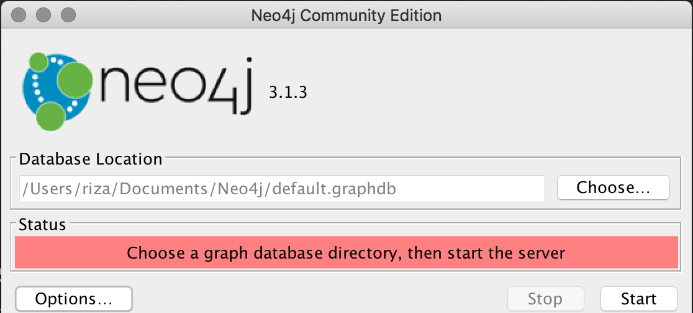
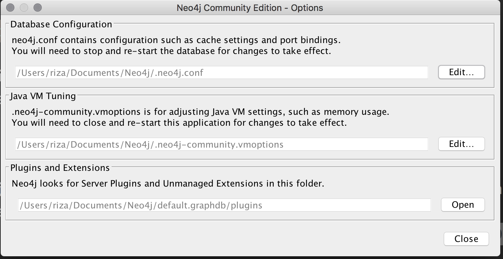
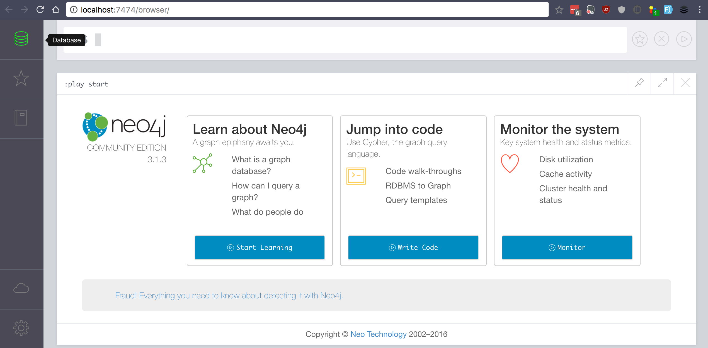

> Tutorial ini menggunakan Node v6.9.1, Express v4.15.x, dan Neo4j vX.X.X.

Mari kita membuat sebuah aplikasi sosial media sederhana dengan [NodeJS](https://nodejs.org/). Salah satu fitur yang akan kita implementasi di aplikasi ini adalah rekomendasi teman. Untuk memudahkan kita membangun fitur tersebut, kita akan menggunakan graph database [Neo4j](https://neo4j.com/). Graph database terkenal dengan kemudahannya dalam merepresentasikan data kompleks seperti data social media dalam hal relasi antar *user*.

Berikut gambaran hasil akhir aplikasi yang akan kita kembangkan

TODO: Image final product

Beberapa fitur yang akan kita implementasikan diantaranya:

* Register
* Login
* Logout
* Likes
* Tags
* Similar user

Dengan graph database seperti Neo4j, membuat aplikasi seperti ini menjadi sangat mudah yang mungkin cukup kompleks apabila menggunakan database relasional ataupun jenis database NoSQL lainnya.

## Daftar Isi

TODO: Mungkin perlu daftar isi.

## Perkenalkan, Graph Database dan Neo4

Tidak seperti sistem database lainnya yang direpresentasikan melalui tabel atau dokumen, graph database adalah sebuah sistem database yang menggunakan struktru grafik yang terdiri dari *nodes, edges, * dan *properties* untuk merepresentasikan data.

Dan [Neo4j](https://neo4j.com) adalah sebuah sistem graph database yang dikembangkan oleh Neo Technology, Inc. Dan Neo4j adalah graph database terpopuler saat ini. Dengan representasi grafis, untuk beberapa kasus, menjadi lebih sederhana dan justru lebih ekspresif. Selain social media, graph database seringkali ditemukan di beberapa aplikasi seperti:

* [fraud detection](https://neo4j.com/use-cases/fraud-detection/)
* [recommendation engine](http://neo4j.com/use-cases/real-time-recommendation-engine/)
* [access management](http://neo4j.com/use-cases/identity-and-access-management/)
* dan lain sebagainya.

### Instalasi Neo4j

Untuk melakukan instalasi Neo4j cukup sederhana. Tinggal [download](https://neo4j.com/download/community-edition/) dan jalankan sesuai sistem operasi masing-masing.

Tapi sebelum menjalankan *service*-nya, klik *options* terlebih dahulu untuk men-*disable* fitur *authentication* agar mempermudah kita di awal persiapan. Kili edit di bagian *database configuration* dan ubah settingan `dbms.security.auth_enabled` dari `true` menjadi `false` di teks editor yang dibuka oleh Neo4j.

Setelah selesai, tutup dan barulah kita nyalakan service neo4j dan ketika sudah nyala, kita bisa mengakses melalui browser dengan alamant [http://localhost:7474/browser/](http://localhost:7474/browser/).

### Eksplorasi Neo4j

Mari kita sedikit mengeksplorasi neo4j sebelum menulis *code* untuk aplikasi kita. Neo4j mempersiapkan beberapa database 'dummy' sebagai demo untuk kita bereksplorasi. Untuk mencobanya, kita bisa ke menu 'Favorite' yang bergambar ⭐️ kemudian pilih 'Example Graph' dan pilih 'Movie Graph'.
