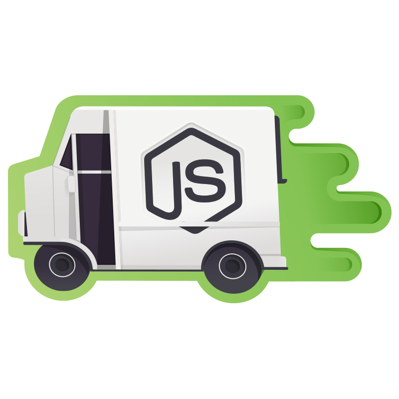
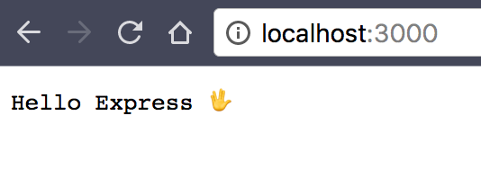

Artikel ini merupakan bagian pertama dari seri mega tutorial dimana saya mendokumentasikan pengalaman saya belajar, menggunakan dan mengajar [NodeJS](https://nodejs.org/en/) dan [Express](http://expressjs.com/) web framework.


## Aplikasi Yang Akan Dibuat

Aplikasi yang akan kita buat sepanjang seri ini adalah aplikasi _online course_ sederhana yang memiliki lebih dari cukup untuk mendemonstrasikan kehebatan NodeJS, Express dan teman-temannya.

Berikut beberapa topik yang akan kita bahas selama seri ini:

* Manajemen user, termasuk login/logout, session, user roles, user profile dan mungkin ?avatar.
* Manajemen database, termasuk _?migration_
* Form dan validasi field
* _Pagination_ untuk halaman yang memiliki item yang banyak
* ?Full text search
* Notifikasi email ke user
* Template HTML dan berbagai macam pilihannya
* Caching dan berbagai teknik optimisasi lainnya
* Teknik debug
* Deploy ke production server

Seperti yang kalian bisa lihat dari daftar diatas, kita akan belajar banyak, nyaris semuanya dan kita akan membuat aplikasi yang _production-ready_. _Excited?!_ Tentu saja!

## Requirement

Kita akan menggunakan [NodeJS](https://nodejs.org/) versi 8. Jika masih menggunakan versi 6 juga sepertinya tidak terlalu masalah, seharusnya. Tapi versi yang direkomendasikan adalah versi 8 atau lebih. 
Tutorial ini berasumsi bahwa kamu sudah terbiasa dengan terminal atau command-line dan sudah memahami perintah-perintah dasar untuk manajemen file dan folder seperti `cd, ls, mkdir, touch` dan lain sebagainya.

## Install Express

Ok, mari kita mulai

Buat yang belum install nodejs, silakan langsung ke website-nya: https://nodejs.org/en/ dan install sesuai sistem operasi yang digunakan.

Setelah selesai, pastikan kamu sudah dapat menjalankan dua perintah `node` dan `npm` seperti berikut:

```text
$ node -v
v8.0.0
$ npm -v
5.0.0
```

Sekarang kita akan membuat aplikasi baru dengan nama folder `express_course` dan inisialisasi project dengan perintah `npm init`.

```text
$ mkdir express_course
$ cd express_course
$ npm init
```

Setelah selesai, struktur folder kita akan seperti berikut:

```text
.
└── package.json
```
npm membuatkan satu file `package.json` sebagai tempat kita mencatat berbagai paket yang kita gunakan di project ini. Sekarang kita akan melakukan instalasi express dengan menggunakan `npm` dan menyimpan informasi paket di `package.json`

```text
$ npm install --save express
```

Setelah terinstall, sekarang `package.json` kita akan terlihat seperti berikut:

```json
{
  "name": "express_course",
  "version": "1.0.0",
  "description": "",
  "main": "index.js",
  "scripts": {
    "test": "echo \"Error: no test specified\" && exit 1"
  },
  "author": "",
  "license": "ISC",
  "dependencies": {
    "express": "^4.15.3"
  }
}
```

Sudah tercantum `express` di daftar _dependencies_. Sekarang saatnya kita gunakan Express didalam sebuah file. Kita buat file baru dan namakan `app.js`.

```javascript
// app.js
const express = require('express')

const app = express()

app.get('/', (req, res) => {
  return res.send('Hello Express 🖖')
})

app.listen(3000, (err) => {
  if (err) throw err
  console.log('🏃‍♂️-> http://localhost:3000/')
})
```

Pertama-tama kita melakukan import dari paket express kemudian kita definisikan `app` dan membuat sebuah _route_ utama '/'. Jadi setiap kali user mengakses '/' kita akan mengirimkan pesan 'Hello Express'. Dan terakhir kita pastikan `app` me-_listen_ port 3000.

Jika kita jalankan `app.js` dengan mengetikkan perintah:

```text
$ node app.js
🏃‍♂️ -> http://localhost:3000/
```

Sekarang kita akan dapat mengakses http://localhost:3000/ dari browser akan muncul 'Hello Express' 👍.



Dan dengan demikian kita sudahi dulu artikel perdana untuk seri ini. Buat yang ingin melihat hasil dari _code_ tadi, bisa ke [repo github berikut](https://github.com/rizafahmi/express_mega_course/tree/15888874e7505e4c94b5d93e212b855071aabbd4). Untuk menjalankannya kamu tinggal clone reponya, jalankan `npm install` dan `node app.js`.

## Berikutnya

Di artikel berikutnya kita akan bermain-main dengan HTML dan template. Sampai bertemu di artikel berikutnya!

