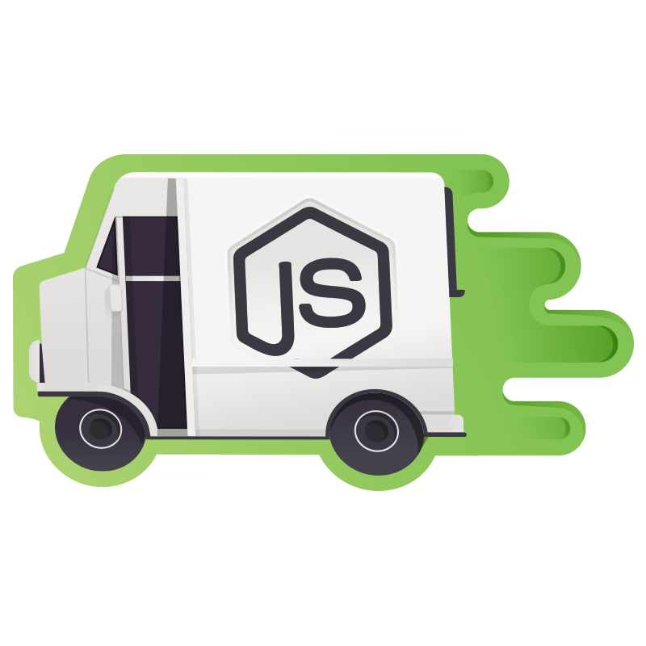
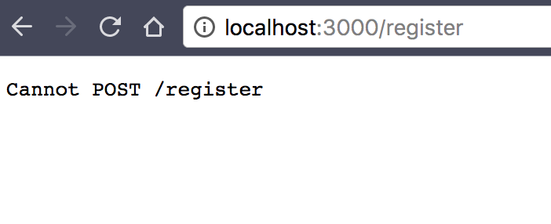

Artikel ini merupakan bagian ketiga dari seri mega tutorial dimana saya mendokumentasikan pengalaman saya belajar, menggunakan dan mengajar [NodeJS](https://nodejs.org/en/) dan [Express](http://expressjs.com/) web framework.

Aplikasi yang kita buat sepanjang seri ini adalah aplikasi _online course_ sederhana yang memiliki lebih dari cukup untuk mendemonstrasikan kehebatan NodeJS, Express dan teman-temannya. Kita namakan saja `express_course`.



**NOTE**: Artikel ini menggunakan [NodeJS](https://nodejs.org/en/) versi 8.0.0 dan [MongoDB](https://mongodb.com) versi 3.4.0.


## Rekap

Jika kalian mengikuti [artikel sebelumnya](), kita seharusnya sudah memiliki aplikasi web sederhana dengan struktur direktori sebagai berikut:

```text
express_course
.
├── app.js
├── package-lock.json
├── package.json
└── views
    ├── index.pug
    └── layout.pug

```

Untuk menjalankannya kita tinggal menggunakan perintah `node app.js` kemudian web kita dapat diakses di http://localhost:3000/ di browser.

Di artikel ini kita akan melanjutkan dari aplikasi ini. Jadi pastikan aplikasi kamu jalan normal.

## Database

Sekarang kita ingin membuat mekanisme register, login dan logout untuk aplikasi Express Course kita. Untuk itu kita butuh sebuah database untuk 'menemani' web framework kita. Ada beberapa pilihan yang bisa kita gunakan dengan Express seperti database relasional misalnya [PostgreSQL](https://www.postgresql.org/), [MySQL](https://www.mysql.com/) dan yang lainnya. Atau kita bisa memilih rute NoSQL yang sedang ngetren saat ini. Pilihannya ada banyak juga, mulai dari [Redis](https://redis.io/), [MongoDB](https://www.mongodb.com/), [CouchDB](http://couchdb.apache.org/), [RethinkDB](https://www.rethinkdb.com/), ataupun banyak opsi lainnya.

Dan untuk artikel ini kita akan menggunakan MongoDB sebagai database. MongoDB merupakan _document-based_ NoSQL database yang cukup populer sehingga akan lebih familiar buat kita semua. Apalagi buat yang belum terbiasa dengan database NoSQL cenderung lebih mudah memahami MongoDB.

### Setting Up MongoDB

Buat yang belum menginstal MongoDB silakan ikuti [langkah-langkahnya disini](https://www.mongodb.com/download-center?jmp=nav) sesuaikan dengan sistem operasi masing-masing. Dan bila sudah melakukan instalasi MongoDB sekarang jalankan service-nya.

```text
$ mongo --version
```

Pastikan versi yang kita gunakan setidaknya versi 3.4 atau yang lebih baru. Sekarang kita jalankan _service_ mongodb nya di background dengan perintah berikut:

```text
$ mongod --fork --logpath /dev/null
```

Kamu juga bisa menjalankan service `mongod` yang berjalan di foreground dengan perintah berikut:

```text
$ mongod
```

Atau juga dengan menggunakan metode lain seperti `sudo service mongod start` di ubuntu dan lain sebagainya. Silakan cari referensi sendiri untuk hal ini lah ya :)

Dan untuk meyakinkan service mongodb kita sudah jalan, kita bisa menggunakan MongoDB GUI seperti [Robomongo](https://robomongo.org/) ataupun [MongoDB Compass](https://www.mongodb.com/products/compass) dan setting koneksi ke localhost dan port 27017. Apabila berhasil, selamat! Artinya mongodb siap digunakan.

### Setting Up Mongoose ODM

Untuk interface ke NodeJS kita akan menggunakan [Mongoose](http://mongoosejs.com/) sebagai _Object Document Mapper_ atau ODM. Menggunakan ODM mempermudah kita dalam menggunakan MongoDB dalam project kita. Mari kita install Mongoose di project kita.

```text
$ npm install mongoose
```

Mari kita coba koneksi dari NodeJS ke MongoDB dengan Mongoose. Buka file `app.js` dan tambahkan code berikut:

```javascript
// app.js

const path = require('path')
const express = require('express')
const mongoose = require('mongoose')

mongoose.connect('mongodb://localhost/test')
const db = mongoose.connection
db.once('open', () => {
  console.log('Connected to mongodb!')
})

const app = express()

// ...
```


Ketika kita jalankan...

```text
$ node app.js
🏃‍♂️ -> http://localhost:3000/
Connected to mongodb!
```

Sip! Kita sudah berhasil connect ke mongodb. Sekarang mari kita membuat model untuk user yang akan kita gunakan untuk login. Kita akan menyimpan semua model kedalam sebuah folder `models`. Buat foldernya dan buat file baru didalam folder tersebut.

### Skema User

```text
$ mkdir models && cd models
```

Kita butuh beberapa library seperti [md5](https://www.npmjs.com/package/md5) untuk melakukan _hashing_ password, [validator](https://www.npmjs.com/package/validator) untuk proses validasi form, [mongoose-mongodb-errors](https://www.npmjs.com/package/mongoose-mongodb-errors) untuk mengubah error dari mongodb menjadi pesan error yang lebih manusiawi. Terakhir, kita juga akan menggunakan library [passport.js](http://passportjs.org/) untuk otentikasi.

Mari kita install dulu aja ya dengan npm. Kemudian kita akan jelaskan fungsi _library_ tersebut satu persatu.

```text
$ npm install md5 validator mongoose-mongodb-errors passport-local-mongoose
```

Kemudian kita import masing-masing library diatas dan mulai menulis skema untuk model User. User akan butuh email atau username, nama dan tentunya password. Nah kita bisa gunakan library [passport.js](http://passportjs.org) untuk membantu kita menangani skema user ini. Jadi yang kita butuhkan di skema User adalah email dan nama saja. Password dan data lainnya terkait otentikasi akan ditangani oleh passport.

Passport sendiri banyak sekali memiliki _plugins_ atau di website mereka menyebutnya dengan istilah [strategies](http://passportjs.org). Mulai dari login Facebook, Twitter, oAuth, LinkedIn, Steam, dan ada 300-an strategi yang lainnya! Untuk project ini kita akan menggunaka strategi local. Artinya menggunakan email dan password di local database. Mari kita definisikan skema usernya di file `models/User.js`.

```javascript
// models/User.js
const mongoose = require('mongoose') const Schema = mongoose.Schema
mongoose.Promise = global.Promise
const md5 = require('md5')
const validator = require('validator')
const mongodbErrorHandler = require('mongoose-mongodb-errors')
const passportLocalMongoose = require('passport-local-mongoose')

const userSchema = new Schema({
  email: {
    type: String,
    unique: true,
    lowercase: true,
    trim: true,
    validate: [validator.isEmail, 'Invalid email address'],
    required: 'Please supply an email address'
  },
  name: {
    type: String,
    required: 'Please supply a name',
    trim: true
  }
})

userSchema.plugin(passportLocalMongoose, { username: 'email' })
userSchema.plugin(mongodbErrorHandler)

module.exports = mongoose.model('User', userSchema)
```

Kita juga melakukan validasi yang cukup komprehensif disini, terutama untuk email. Kita harus memastikan email yang dimasukkan user itu tipenya `String`, unik, semua huruf kecil, tanpa spasi, harus diisi dan terakhir kita validasi apakah alamat email tersebut valid dengan bantuan library [validator](https://www.npmjs.com/package/validator). Sementara untuk nama, validasinya lebih sederhana.

Kemudian kita juga tidak lupa mendefinisikan plugin yang ingin kita gunakan, yaitu `passport-local-mongoose` dan definisikan juga kita akan menggunakan email sebagai username. Plugin berikutnya yang akan kita gunakan adalah `mongodbErrorHandler` yang akan memberikan pesan kesalahan yang lebih _user friendly_ ketika email yang di entry tidak unik. Apabila tidak menggunakan plugin ini, pesan kesalahannya sedikit kriptik seperti berikut: `"11000 - duplicate key"`.

Terakhir, kita export skema usernya agar dapat digunakan oleh modul lainnya.

Ok, skema user sudah selesai sekarang saatnya kita membuat route dan template untuk registrasi usernya.

### Form Registrasi

Sebelum membuat template, yuk kita definisikan terlebih dahulu _route_ dan _controller_ untuk modul user di `app.js` dan `controllers/userController.js`.

```javascript
// app.js

const path = require('path')
const express = require('express')
const mongoose = require('mongoose')

const userController = require('./controllers/userController.js')

mongoose.connect('mongodb://localhost/test')
const db = mongoose.connection
db.once('open', () => {
  console.log('Connected to mongodb!')
})

const app = express()

app.set('views', path.join(__dirname, 'views'))
app.set('view engine', 'pug')

app.get('/', (req, res) => {
  const user = {
    username: 'riza'
  }
  const courses = [
    { id: 1, title: 'Introduction to ExpressJS' },
    { id: 2, title: 'Database with NodeJS and ExpressJS' }
  ]

  return res.render('index', {
    user: user,
    title: 'Welcome to Express Course',
    courses: courses
  })
})

app.get('/register', userController.registerForm)

app.listen(3000, (err) => {
  if (err) throw err
  console.log('🏃‍♂️ -> http://localhost:3000/')
})
```

```javascript
// controllers/userController.js

const mongoose = require('mongoose')

exports.registerForm = (req, res) => {
  res.render('register', { title: 'Register' })
}
```

Lalu kita masuk ke bagian _views_ nya dan buat sebuah form registrasi dengan nama `views/register.pug`.

```jade

extends layout

block content
  h2 #{title}
```

Sekarang mari kita coba. Untuk melihat perubahan setiap kali ada _code_ yang kita tambahkan, kita haru selalu melakukan restart terhadap aplikasi node kita dengan menggunakan Ctrl+c dan memanggil ulang perintah `node app.js`. Ada _tools_ yang bisa kita gunakan untuk membuat hal ini menjadi otomatis. Caranya dengan menggunakan [nodemon](https://nodemon.io). Kita bisa melakukan instalasi secara global dengan perintah `npm install -g nodemon`. Dan sekarang kita dapat menggunakan perintah `nodemon app.js`. Dan setiap ada perubahan dia akan me-reload secara otomatis.

```text
$ nodemon app.js
```

Dan sekarang kalau kita menuju ke _route_ register di http://localhost:3000/register, oopps ada error nih!


Seperti terlihat ada pesan error: `Cannot read property 'username' of undefined` di `views/layout.pug` baris 11. Dan benar sekali, `layout.pug` kita membutuhkan variable `user.username` sementara di `controllers/userController.js` kita tidak menyertakan variable tersebut. Karena itu untuk sementara kita bisa gunakan kondisi untuk mengecek apakah user ada atau tidak di `views/layout.pug`.

```jade
html
  head
    if title
      title #{title}
    else
      title Express Course
    block css
    block js
  body
    block header
      if user
        h1 #{user.username}
    block content
    block footer
      footer
        p &copy; 2017 Express Course
```

Dan kalau browser di refresh sekarang sudah muncul halaman registrasi 🎉. Sebelum kita lanjut pembuatan form registrasi, tampilan web kita saat ini terasa cukup hambar tanpa _styling_. Mari kita tambahkan sedikit styling biar lebih keren.

Nah untuk menambahkan _styling_ kita membutuhkan bantuan [Express](http://expressjs.com/en/starter/static-files.html) lagi. File-file seperti gambar, css, javascript dan lain sebagainya sering disebut dengan _static file_. Dan untuk menggunakannya di Express, kita perlu memberitahu express bahwa kita akan menggunakan static file beserta folder yang akan menjadi destinasinya. Buka file `app.js` dan tambahkan satu baris kode ini.

```app.js
// app.js

// ...
const app = express()

app.use(express.static('public'))

app.set('views', path.join(__dirname, 'views'))
app.set('view engine', 'pug')

// ...
```

Kemudian buat folder dengan nama `public` dan masukkan semua static file yang kita butuhkan disana.

```text
./public
├── css
│   ├── main.css
│   └── vendors
│       ├── milligram
│       │   ├── milligram.css
│       │   ├── milligram.css.map
│       │   ├── milligram.min.css
│       │   └── milligram.min.css.map
│       └── normalize.css
├── fonts
├── img
└── js
```

Download saja static file-nya [disini](static.zip) dan extract ke public folder. Langkah selanjutnya kita perlu merevisi `layout.pug` dan `register.pug`. `index.pug` nanti saja menyusul. Silakan _copy-paste_ saja file layout dan register dibawah. Kita tidak akan membahas banyak tentang layouting, HTML dan CSS disini. Jadi kita bisa fokus ke pengembangan di sisi server.

```jade
html
  head
    if title
      title #{title}
    else
      title Express Course
    block css
      link(href="//fonts.googleapis.com/css?family=Roboto:300,300italic,700,700italic", rel="stylesheet")
      link(href="/css/vendors/normalize.css", rel="stylesheet")
      link(href="/css/vendors/milligram/milligram.min.css", rel="stylesheet")
      link(href="/css/main.css", rel="stylesheet")
    block js
  body
    main.wrapper
      block header
        nav.navigation
          .container
            a.navigation-title(href="/")
              h1.title Express Course
            ul.navigation-list.float-right
              li.navigation-item
                a.navigation-link(href="/register")
                  p Register
              li.navigation-item
                a.navigation-link(href="/login")
                  p Login
        if user
          h1 #{user.username}
        .wrapper
          .section.text-center(style="padding: 64px")
      .container
        block content

      .footer.footer
        .container
          block footer
            .copyright &copy; 2017 Express Course

```

Kemudian untuk `register.pug`.

```jade
extends layout

block content
  h3.title #{title}
  .example
    form(action="/register" method="POST")
      fieldset
        label Name
        input(type="text", placeholder="Your beautiful name", name="name", required)
        label Email
        input(type="email", placeholder="Your email address", name="email", required)
        label Password
        input(type="password", placeholder="Your super secret password", name="password", required)
        label Confirm Password
        input(type="password", placeholder="Confirm your super secret password", name="confirmPassword", required)
        button.btn.btn-primary.btn-round.btn-block.btn-lg(type="submit") Register


```

Lumayan banyak perubahannya ya. Tapi worthed kok. Coba sekarang di refresh. Halaman register kita jadi cukup indah!


Dan ketika kita klik button register, maka kita akan bertemu dengan pesan error yang _expected_.



Ok sekarang balik ke `app.js`, kita harus membuat sebuah route ke `/register` yang bertipe `POST`. Tapi sebelum itu kita butuh beberapa tahapan disini:

1. Validasi user input
2. Registrasi user
3. Login user secara otomatis

Mari kita mulai dari validasi user input.

#### Validasi User Input

Kita memang sudah melakukan beberapa validasi di sisi database seperti validasi email, dan lain sebagainya. Tapi kita juga perlu melakukan validasi sebelum 'menyentuh' ke database. Misalnya saja ada yang iseng meng-inject kode seperti `<script>` dan lain sebagainya. Dan untuk melakukan itu kita bisa menggunakan _middleware_.

Kita akan menggunakan library [express-validator](https://www.npmjs.com/package/express-validator) untuk membantu kita melakukan validasi. Dan kita juga akan membutuhkan [flash](https://github.com/jaredhanson/connect-flash) untuk menampilkan pesan error.
Kita juga membutuhkan library [body-parser](https://www.npmjs.com/package/body-parser) untuk berinteraksi dengan form html.

```text
$ npm install express-validator connect-flash body-parser
```

Dan kita gunakan di `app.js` kita.

```javascript
// app.js

const path = require('path')
const express = require('express')
const mongoose = require('mongoose')
const expressValidator = require('express-validator')
const flash = require('connect-flash')

const userController = require('./controllers/userController.js')

mongoose.connect('mongodb://localhost/test')
const db = mongoose.connection
db.once('open', () => {
  console.log('Connected to mongodb!')
})

const app = express()

app.use(express.static('public'))
app.use(expressValidator())
app.use(flash())
app.set('views', path.join(__dirname, 'views'))
app.set('view engine', 'pug')

// ...
```


Dan dengan demikian kita sudahi dulu artikel kedua untuk seri ini. Buat yang ingin melihat hasil dari _code_ tadi, bisa ke [repo github berikut](https://github.com/rizafahmi/express_mega_course/tree/d1c22f44c2a482eded4672a0b982456accaefea6).

## Berikutnya

Di artikel berikutnya kita akan bermain-main dengan HTML form dan registrasi user. Pertanyaan atau komentar langsung saja sampaikan di _comment box_ dibawah ya. Sampai bertemu di artikel berikutnya!

