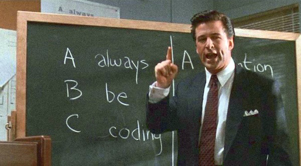
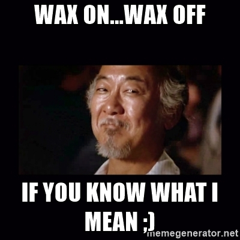
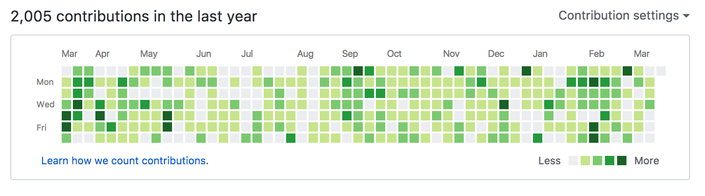

> “Genius is 1% talent and 99% percent hard work...” -- Albert Einstein

Untuk menjadi *developer* handal tidak ada cara yang lebih baik daripada berlatih dan berlatih setiap hari.

Berikut beberapa tips singkat berlatih *coding* setiap hari menyulap kamu menjadi *developer* yang lebih baik dirangkum dari beberapa artikel.

## Coding setiap hari

Sempatkan untuk *coding* setiap hari. Tidak masalah bahasa pemrogramannya apa atau *project*-nya apa. Yang penting selalu *coding* setiap hari.

Hal ini juga saya rasakan ketika saya tidak *coding* dalam rentang waktu beberapa lama, terkadang ketika kembali *coding* terasa sedikit lemot, seperti *jetlag* dan harus beradaptasi kembali dengan berbagai hal.

Dengan melakukan latihan *coding* setiap hari, kita menjaga momentum, *flow* dan disiplin. Layaknya latihan yang diberikan oleh [Mr. Miyagi](http://www.imdb.com/character/ch0007693/?ref_=tt_cl_t2) dalam film [Karate Kid](http://www.imdb.com/title/tt0087538/?ref_=nv_sr_1).

Pada awalnya latihan yang diberikan Mr. Miyagi dirasa tidak berguna oleh [Daniel](http://www.imdb.com/name/nm0001494/?ref_=tt_cl_t1) yang ingin segera belajar jurus dan ogah belajar fundamental. Tetapi dengan berlatih hal fundamental secara terus menerus melatih reflek dan naluri saat bertarung nantinya.

**Pro tip**: Gunakan [GitHub](https://github.com) agar profil kamu menjadi lebih keren!

## Cobalah sesuatu yang baru

Setiap beberapa bulan sekali, cobalah sesuatu yang baru. Bisa berupa bahasa pemrograman baru, editor baru, OS baru atau apapun.

Cobalah sesuatu yang kamu bahkan tidak yakin kamu akan sukai. Tantang diri kamu dan keluar dari zona nyaman. Katakanlah kamu tidak menyukai Microsoft, cobalah menggunakan C# atau TypeScript. Atau tidak suka Apple? Cobalah Swift. Kamu fans [VIM](http://www.vim.org/)? Cobalah [Emacs](https://www.gnu.org/software/emacs/) :)

Latihan ini akan membuat kita belajar berfikir *out-of-the-box* dengan cara memantang dirimu setiap kesempatan. Pasti ada sesuatu yang dapat kita pelajari dari berbagai bahasa ataupun *platform* yang berbeda.

Hal ini juga pernah saya alami. Ketika pertama kali belajar bahasa pemrograman fungsional [Erlang](https://www.erlang.org/), saya merasa pusing, mual dan ingin muntah. Tetapi setelah beberapa waktu, setelah belajar [Elixir](http://elixirdose.com/) sekarang *code* [Erlang](https://www.erlang.org/) tidak lagi begitu menyeramkan.

## Ikuti dan terapkan paradigma di setiap bahasa atau platform

Berkaitan dengan tips sebelumnya, ketika mencoba bahasa, paradigma atau *platform* baru, gunakanlah se-*idiomatic* mungkin. Kita mencoba sesuatu yang baru tujuannya untuk belajar dan dengan belajar idiom baru, kita juga dapat lebih mengerti mengapa bahasa pemrograman satu berbeda dengan bahasa pemrograman lainnya.

Sebagai contoh, cobalah untuk se-*object-oriented* mungkin ketika mencoba [Java](https://www.java.com/en/) atau [Kotlin](https://kotlinlang.org/) karena memang naturalnya seperti itu.

Setelah beberapa lama, kembali bereksperimen. Gunakan sebuah bahasa dengan cara yang berbeda. Misalnya hindari penggunaan *for loop* di [Ruby](https://www.ruby-lang.org/en/) dan gunakan metode rekursif untuk melatih *mindset* *functional programming*. Berkreasilah!

## Belajar paradigma baru akan bermanfaat

Ada beberapa kalangan yang percaya belajar *functional programming* akan mengubah kamu menjadi *developer* yang lebih rapi dalam menulis code. Kenapa? Karena di dalam *functional programming* kita dituntut berpikir bagaimana mengubah sebuah data yang di input ke sebuah fungsi dan me *return* hasilnya.

Cara-cara atau trik di *functional programming* tentu dapat digunakan di paradigma lainnya dan akan bermanfaat membuat code yang lebih baik ketika kamu menulis code di bahasa pemrograman yang kamu gunakan sehari-hari.

Contoh lain misalnya dengan belajar *declarative programming* dapat meningkatkan pemahaman kita terhadap *immutability* dan lain sebagainya.

Banyak pula praktek-praktek OOP yang bisa digunakan di *functional programming* maupun paradigma-paradigma lainnya.

Contohnya video singkat nan lucu berikut yang berjudul "Advanced OOP in Elixir" oleh Wojtek Mach di ElixirConfEU 2016 yang lalu. Sangat *out-of-the-box*!

<iframe width="560" height="315" src="https://www.youtube.com/embed/5EtV2JUU0Z4" frameborder="0" ></iframe>

## Latihan repetisi dengan Code Kata

Istilah *katas* adalah ungkapan bahasa Jepang yang artinya melatih gerakan dalam konteks bela diri. *Code katas* adalah latihan *coding* untuk mengasah *skill programming* kamu melalui latihan dan repetisi.

Repetisi penting untuk melatih otot memori kita agar dapat secara cepat dan melatih 'reflek' kita dalam programming. Repetisi sangat dibutuhkan untuk menguasai sesuatu. Seperti analogi Mr. Miyagi diatas.

Berikut adalah *quote* dari salah satu tokoh idola saya, [David Kadavy](http://kadavy.net/) tentang repetisi yang dikutip dari artikel yang berjudul [The Powerful Power of Repetition](https://mystudentvoices.com/the-powerful-power-of-repetition-820adee3ecfe#.4qz3w317s).

> "There is a powerful power in repetition. Each time you repeat something, you notice something different. Each time you repeat something, there’s some piece — now stored in your long-term memory, instead of being frantically processed by your short-term memory — that just comes easier." -- David Kadavy

Beberapa coding bootcamp seperti [HackReactor](http://www.hackreactor.com/) dan [Hacktiv8](https://hacktiv8.com/) pun menyarankan *students*-nya untuk berlatih *code katas* setiap hari. Bahkan beberapa perusahaan saat ini menggunakan soal-soal dan website code katas sebagai referensi.

Beberapa website yang dapat kamu gunakan diantaranya:

* [http://codekata.com](http://codekata.com)
* [https://www.codewars.com](https://www.codewars.com)
* [https://coderbyte.com](https://coderbyte.com)
* [https://www.codingame.com/home](https://www.codingame.com/home)
* [https://codefights.com](https://codefights.com)
* [https://www.hackerrank.com](https://www.hackerrank.com)

Bahkan website HackerRank mengadakan tantangan 30 days of code yang bisa kita ikuti untuk melakukan kegiatan #alwaysBeCoding.

## Referensi

* [ABC - Always Be Coding, David Byttow](https://medium.com/always-be-coding/abc-always-be-coding-d5f8051afce2#.sdh1eygvw)
* [Why coding everyday makes a big difference, Coder Radio, Always Be Coding](http://www.jupiterbroadcasting.com/107311/always-be-coding-cr-247/)
* [5 Reasons To Always be Coding](http://www.humblecoder.com/5-reasons-to-always-be-coding/)
* [The powerful power of repetition, David Kadavy](https://mystudentvoices.com/the-powerful-power-of-repetition-820adee3ecfe#---5-290.9ofans17m)
