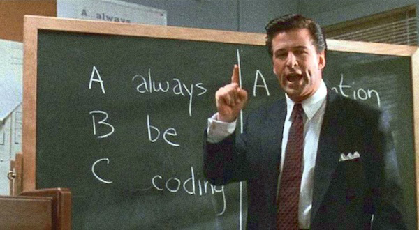
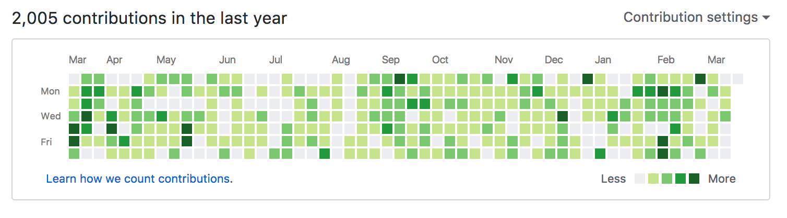

> “Genius is 1% talent and 99% percent hard work...” -- Albert Einstein

Untuk menjadi *developer* handal tidak ada cara yang lebih baik daripada berlatih dan berlatih setiap hari.

Berikut beberapa tips singkat berlatih *coding* setiap hari menyulap kamu menjadi *developer* yang lebih baik dirangkum dari beberapa artikel.

## Coding setiap hari

Sempatkan untuk *coding* setiap hari. Tidak masalah bahasa pemrogramannya apa atau *project*-nya apa. Yang penting selalu *coding* setiap hari.

**Pro tip**: Gunakan [GitHub](https://github.com) agar profil kamu menjadi lebih keren!

## Cobalah sesuatu yang baru

Setiap beberapa bulan sekali, cobalah sesuatu yang baru. Bisa berupa bahasa pemrograman baru, editor baru, OS baru atau apapun.

## Ikuti dan terapkan paradigma di setiap bahasa atau platform

Berkaitan dengan tips sebelumnya, ketika mencoba bahasa, paradigma atau platform baru, usahakan se *idiomatic* mungkin. Kita mencoba sesuatu yang baru tujuannya untuk belajar dan dengan belajar idiom baru, kita juga dapat lebih mengerti mengapa bahasa pemrograman satu berbeda dengan bahasa pemrograman lainnya.

Sebagai contoh, cobalah untuk se-object-oriented mungkin ketika mencoba Java atau Kotlin karena memang naturalnya seperti itu. Jangan memaksakan menulis code Java dengan gaya fungsional atau JavaScript atau yang lainnya.

## Belajar paradigma baru akan bermanfaat

Ada beberapa kalangan yang percaya belajar functional programming akan mengubah kamu menjadi developer yang lebih rapi dalam menulis code. Kenapa? Karena di dalam functional programming kita dituntut berpikir bagaimana mengubah sebuah data yang diinput ke sebuah fungsi dan me-return hasilnya.

Cara-cara atau trik di functional programming tentu dapat digunakan di paradigma lainnya dan akan bermanfaat membuat code yang lebih baik.

Ilustrasi diatas hanya contoh. Banyak pula praktek-praktek OOP yang bisa digunakan di functional programming maupun paradigma-paradigma lainnya.

## Tantang Dirimu Mencoba Hal Yang Tidak Terpikirkan

Belajar berfikir *out-of-the-box* dengan cara memantang dirimu setiap kesempatan. Katakanlah kamu tidak menyukai Microsoft, cobalah menggunakan C# atau TypeScript. Atau tidak suka Apple? Cobalah Swift.

## Latihan repetisi dengan Code Kata

Kata adalah ungkapan bahasa Jepang yang artinya melatih gerakan dalam konteks bela diri. Code kata adalah latihan coding untuk mengasah skil programming kamu melalui latihan dan repetisi.

Repetisi penting untuk melatih otot memori kita agar dapat secara cepat dan melatih 'reflek' kita dalam programming. Repetisi sangat dibutuhkan untuk menguasai sesuatu.

[Repetition and Mastery](http://okdork.com/repetition-and-mastery-with-david-kadavy/)

Beberapa coding bootcamp seperti HackReactor dan Hacktiv8 pun menyarankan *students* nya untuk berlatih code kata setiap hari. Bahkan beberapa perusahaan saat ini menggunakan soal-soal yang diambil dari beberapa website code kata sebagai code test-nya.

Beberapa website yang dapat kamu gunakan diantaranya:

* [http://codekata.com](http://codekata.com)
* [https://www.codewars.com](https://www.codewars.com)
* [https://coderbyte.com](https://coderbyte.com)
* [https://www.codingame.com/home](https://www.codingame.com/home)
* [https://codefights.com](https://codefights.com)
* [https://www.hackerrank.com](https://www.hackerrank.com)

Bahkan website HackerRank mengadakan tantangan 30 days of code yang bisa kita ikuti untuk melakukan kegiatan #alwaysBeCoding.

## Referensi

* [ABC - Always Be Coding, David Byttow](https://medium.com/always-be-coding/abc-always-be-coding-d5f8051afce2#.sdh1eygvw)
* [Why coding everyday makes a big difference, Coder Radio, Always Be Coding](http://www.jupiterbroadcasting.com/107311/always-be-coding-cr-247/)
* [5 Reasons To Always be Coding](http://www.humblecoder.com/5-reasons-to-always-be-coding/)
* [Coder to Developer Book, Mike Gunderloy](https://www.amazon.com/Coder-Developer-Strategies-Delivering-Software/dp/078214327X)
