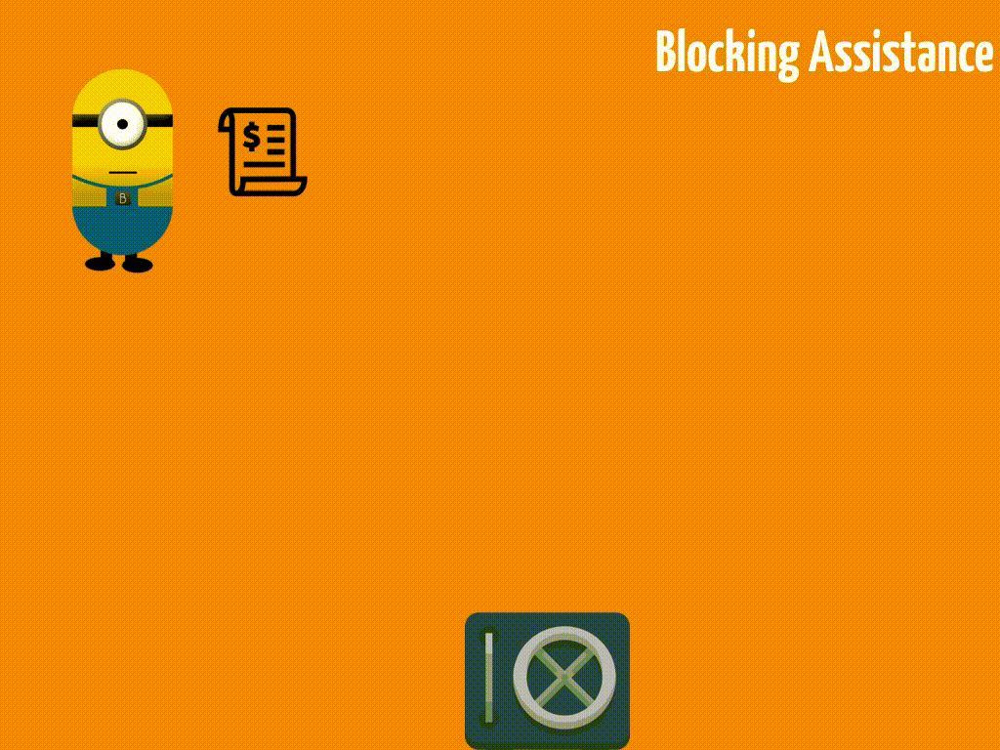

## Apa itu NodeJS

Berikut definisi Nodejs dari websitenya [ nodejs.org ](https://nodejs.org/):

> "Node.js® is a JavaScript runtime built on **Chrome's V8 JavaScript engine**. Node.js uses an **event-driven**, **non-blocking** I/O model that makes it **lightweight** and **efficient**."

Dari definisi tersebut dapat kita ekstrak lagi menjadi NodeJS adalah:

- Kita bisa menulis kode JavaScript di server (dengan bantuan _V8 engine_-nya Chrome)
- NodeJS sifatnya _event-driven_ dan _non-blocking_
- Yang membuat NodeJS ringan atau _lightweight_ dan efisien.

Beberapa bahasa di server yang kita kenal diantaranya ada PHP, Python, Ruby dan lain sebagainya. Dengan adanya platform NodeJS, sekarang kita dapat menggunakan bahasa pemrograman JavaScript di sisi server, bukan hanya di sisi _client_ saja seperti sebelumnya.

Dan yang lebih menarik lagi adalah NodeJS ini sedikit berbeda pendekatannya dengan bahasa _server-side_ pada umumnya karena sifatnya yang _event-driven_ dan _non-blocking_ seperti yang tertera di definisi tadi. Apa itu _event-driven_ dan _non-blocking_? Mari kita lihat ilustrasi berikut.

Perkenalkan, asisten saya bernama Bob. Tugasnya ada tiga:

1. Mengirim _invoice_ ke _client_
2. Menagih uang
3. Memasukkan uang kedalam brankas.

Masalah utama dari si Bob ini adalah semakin banyak _client_ kita, semakin lambat kerjanya si Bob.
