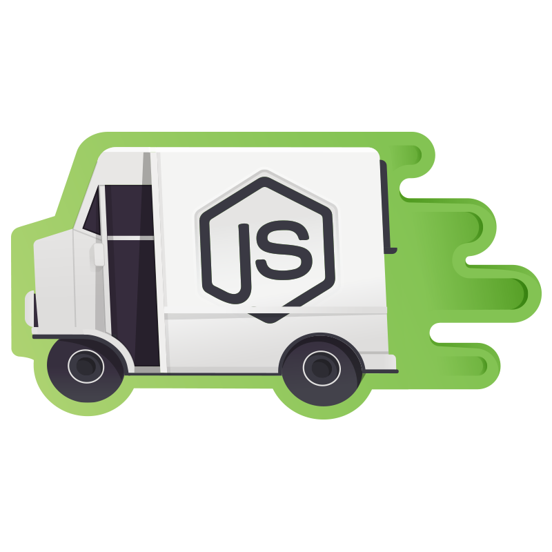
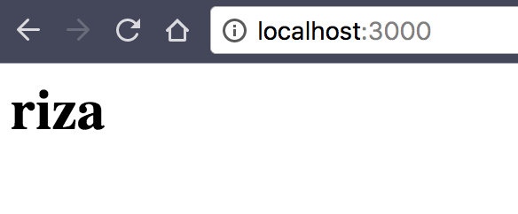
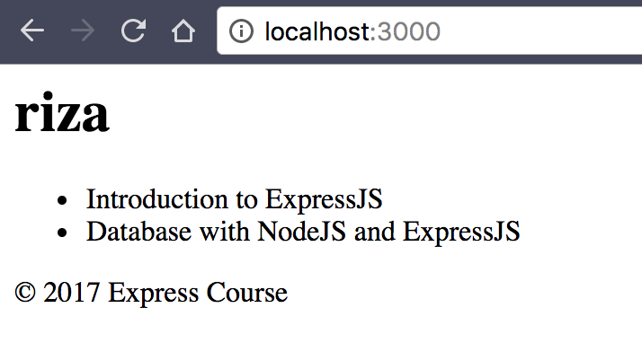

Artikel ini merupakan bagian pertama dari seri mega tutorial dimana saya mendokumentasikan pengalaman saya belajar, menggunakan dan mengajar [NodeJS](https://nodejs.org/en/) dan [Express](http://expressjs.com/) web framework.

Aplikasi yang kita buat sepanjang seri ini adalah aplikasi _online course_ sederhana yang memiliki lebih dari cukup untuk mendemonstrasikan kehebatan NodeJS, Express dan teman-temannya. Kita namakan saja `express_course`.



**NOTE**: Artikel ini menggunakan [NodeJS](https://nodejs.org/en/) versi 8.0.0.


## Rekap

Jika kalian mengikuti [artikel sebelumnya](), kita seharusnya sudah memiliki aplikasi web sederhana dengan struktur direktori sebagai berikut:

```text
express_course
.
├── app.js
├── node_modules
├── package-lock.json
└── package.json
```

Untuk menjalankannya kita tinggal menggunakan perintah `node app.js` kemudian web kita dapat diakses di http://localhost:3000/ di browser.

Di artikel ini kita akan melanjutkan dari aplikasi ini. Jadi pastikan aplikasi kamu jalan normal.

## Kenapa Kita Butuh Template?

Katakanlah kita ingin menambahkan fitur aplikasi Express Course kita dengan sebuah _header_ yang berisi informasi _user_ yang sedang login, cukup umum kan. Jangan pikirin dulu cara loginnya, gimana cara kita menampilkan informasi _user_ di _heading_ sebuah halaman HTML?

Cara yang paling mudah adalah menambahkan sejumlah _code_ HTML di _callback function_ route `/` kita seperti berikut:

```javascript
// app.js
// ...

app.get('/', (req, res) => {
  const user = {
    username: 'riza'
  }
  return res.send(`
  <html>
    <head>
      <title>Home Page</title>
    </head>
    <body>
      <h1>Halo, ${user.username}!</h1>
    </body>
  </html>
  `)
})

```

Coba restart node dengan menekan tombol Ctrl + C dan menjalankan ulang `node app.js` dan buka browser arahkan ke http://localhost:3000/ dan lihat hasilnya.

Bener sih hasilnya sebuah page HTML yang valid, tapi kita baru menampilkan satu informasi doang ini. Setuju kan kalau menggunakan HTML seperti ini adalah sebuah cara yang buruk?! Bayangkan kalau kita menambahkan informasi-informasi lainnya ditambah konten yang dinamis. Tentu _code_ HTML kita membengkak. Dan ketika kita ingin mengganti warna atau _layout_, kita harus mengubah di setiap _code_ HTML tersebut.

Nah makanya kita butuh _template_ untuk membantu kita. Dengan _template_ kita dapat memisahkan antara logic aplikasi kita dengan tampilan atau _view_. Dan lebih mudah diatur juga masing-masing tugasnya. Kita bahkan bisa menugaskan seorang web designer untuk membuat aplikasi kita jadi keren tanpa harus mengubah logic code yang kita buat.

Di Express ada beberapa pilihan bahasa template yang bisa kita pilih. [Pug](https://pugjs.org/api/getting-started.html) atau dulunya namanya Jade, [Handlebars](http://handlebarsjs.com/), [EJS](http://www.embeddedjs.com/), [Hogan](http://twitter.github.io/hogan.js/), [Nunjucks](https://mozilla.github.io/nunjucks/), [doT](https://olado.github.io/doT/index.html) dan banyak lagi yang lainnya.

Untuk seri ini kita akan menggunakan Pug sebagai template engine. Kenapa? Karena bahasanya simpel, dan mudah dibaca. Sebelum kita mulai, mari kita setting terlebih dahulu Express kita untuk menggunakan template engine Pug.
Pertama, kita install terlebih dahulu.

```text
$ npm install --save pug
```

Kemudian kita perlu memberitahu Express bahwa kita akan menggunakan Pug.

```javascript
// app.js
const path = require('path')
const express = require('express')

const app = express()

app.set('views', path.join(__dirname, 'views'))
app.set('view engine', 'pug')

// ...

```

Sekarang saatnya membuat template pug pertama kita. Kita buat dulu folder `views` seperti yang kita setup diatas, dan buat sebuah file dengan nama `index.pug`.

```jade
html
  head
    title Express Course
  body
    h1 #{user.username}
```

**Note**: Jika editor yang kamu gunakan belum menampilkan _syntax_ pug dengan sesuai, bisa install extension pug atau jade.

Cukup simpel kan. Terakhir, kita harus mengganti _method_ `res.send` menjadi `res.render` agar Express merender template yang sudah kita buat.

```javascript
// app.js
const path = require('path')
const express = require('express')

const app = express()

app.set('views', path.join(__dirname, 'views'))
app.set('view engine', 'pug')

app.get('/', (req, res) => {
  const user = {
    username: 'riza'
  }
  return res.render('index', { user: user })
})

app.listen(3000, (err) => {
  if (err) throw err
  console.log('🏃‍♂️ -> http://localhost:3000/')
})
```

**Note**: NodeJS harus di kill menggunakan Ctrl+C kemudian di jalankan kembali setiap ada perubahan. Kita akan menggunakan library untuk membantu masalah ini nanti.

Jika dijalankan, maka akan muncul username di browser.



### Kondisi didalam Template

Dengan Pug kita juga dapat melakukan kondisi dengan perintah `if`. Mari kita buat sebuah kondisi.

```jade
// index.pug
html
  head
    if title
      title #{title}
    else
      title Express Course
  body
    h1 #{user.username}

```

```javascript
// app.js
// ...
app.get('/', (req, res) => {
  const user = {
    username: 'riza'
  }
  return res.render('index', { user: user, title: 'Welcome to Express Course' })
})
// ...
```

Sekarang template kita menjadi lebih pintar. Apabila tidak menyertakan `title`, template akan menampilkan _default title_. Jika `title` disertakan dari controller, maka title akan ditampilkan.

### Perulangan didalam Template

Misalkan kita memiliki beberapa _course_ yang ingin kita tampilkan dihalaman utama, kita tentu butuh perulangan di template seperti `for` atau `while`. Untuk itu kita butuh data _dummy_. Mari kita definisikan data _dummy_ nya terlebih dahulu kemudian kita _attach_ ke template.

```javascript
// app.js
app.get('/', (req, res) => {
  const user = {
    username: 'riza'
  }
  const courses = [
    { id: 1, title: 'Introduction to ExpressJS' },
    { id: 2, title: 'Database with NodeJS and ExpressJS' }
  ]

  return res.render('index', {
    user: user,
    title: 'Welcome to Express Course',
    courses: courses
  })
})
```

Kemudian kita akan tampilkan _courses_ nya di template.


```jade
// index.pug
html
  head
    if title
      title #{title}
    else
      title Express Course
  body
    h1 #{user.username}
    ul
      each course in courses
        li #{course.title}
```

Mudah bukan? Silakan tambahkan _course_ kalau kamu mau.

### Template Inheritance

Satu lagi topik yang akan kita bahas sebelum kita sudahi bagian kedua ini.

Cepat atau lambat aplikasi kita butuh beberapa bagian yang berulang. Contohnya jika kita ingin menggunakan _navigation bar_ di halaman `index.html` dan di halaman-halaman lainnya. Tentu akan repot jika kita harus menyertakan _navigation bar_ di setiap halaman kan ya?! Belum lagi jika ada perubahan yang terjadi di _navigation bar_ kita harus implementasi di semua halaman yang menggunakan _navigation bar_.

Karena itu kita bisa gunakan [template inheritance](https://pugjs.org/language/inheritance.html) untuk memisahkan bagian atau _part_ yang ingin dipakai berulang. Mari kita buat sebuah layout yang akan kita gunakan untuk seluruh aplikasi kita. Kita namakan saja `layout.pug`.

```jade
// layout.pug
html
  head
    if title
      title #{title}
    else
      title Express Course
    block css
    block js
  body
    block header
      h1 #{user.username}
    block content
    block footer
      footer
        p &copy; 2017 Express Course
```

Di template yang kita namakan `layout.pug` ini kita mendefinisikan beberapa block yang nantinya kita isi. Kita bisa mengisi block header, content dan footer. Berhubung block header dan footer sudah ada isinya secara default, maka bisa kita abaikan. Jadi di `index.pug` kita tinggal mengisi block content nya saja.

```jade
extends layout.pug

block content
    ul
      each course in courses
        li #{course.title}
```

Jadi lebih mudah kan?! Kita tidak perlu menyertakan header dan footer lagi. Setiap ada halaman baru kita tinggal isi content-nya dan gunakan header serta footer yang sama. Kita bisa saja mengubah header dan footer jika diperlukan.




Dan dengan demikian kita sudahi dulu artikel kedua untuk seri ini. Buat yang ingin melihat hasil dari _code_ tadi, bisa ke [repo github berikut](https://github.com/rizafahmi/express_mega_course/tree/d1c22f44c2a482eded4672a0b982456accaefea6).

## Berikutnya

Di artikel berikutnya kita akan bermain-main dengan HTML dan form. Pertanyaan atau komentar langsung saja sampaikan di _comment box_ dibawah ya. Sampai bertemu di artikel berikutnya!

