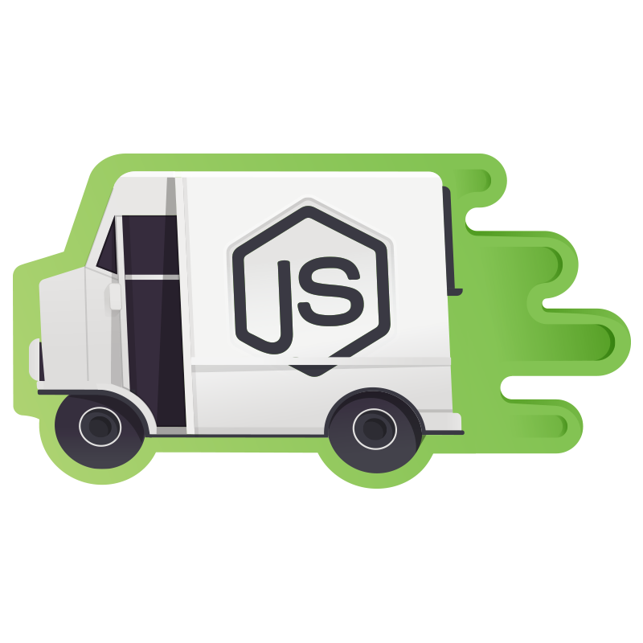

Artikel ini merupakan bagian ketiga dari seri mega tutorial dimana saya mendokumentasikan pengalaman saya belajar, menggunakan dan mengajar [NodeJS](https://nodejs.org/en/) dan [Express](http://expressjs.com/) web framework.

Aplikasi yang kita buat sepanjang seri ini adalah aplikasi _online course_ sederhana yang memiliki lebih dari cukup untuk mendemonstrasikan kehebatan NodeJS, Express dan teman-temannya. Kita namakan saja `express_course`.



**NOTE**: Artikel ini menggunakan [NodeJS](https://nodejs.org/en/) versi 8.0.0 dan [MongoDB](https://mongodb.com) versi 3.4.0.


## Rekap

Jika kalian mengikuti [artikel sebelumnya](), kita seharusnya sudah memiliki aplikasi web sederhana dengan struktur direktori sebagai berikut:

```text
express_course
.
├── app.js
├── package-lock.json
├── package.json
└── views
    ├── index.pug
    └── layout.pug

```

Untuk menjalankannya kita tinggal menggunakan perintah `node app.js` kemudian web kita dapat diakses di http://localhost:3000/ di browser.

Di artikel ini kita akan melanjutkan dari aplikasi ini. Jadi pastikan aplikasi kamu jalan normal.

## Database

Sekarang kita ingin membuat mekanisme register, login dan logout untuk aplikasi Express Course kita. Untuk itu kita butuh sebuah database untuk 'menemani' web framework kita. Ada beberapa pilihan yang bisa kita gunakan dengan Express seperti database relasional misalnya [PostgreSQL](https://www.postgresql.org/), [MySQL](https://www.mysql.com/) dan yang lainnya. Atau kita bisa memilih rute NoSQL yang sedang ngetren saat ini. Pilihannya ada banyak juga, mulai dari [Redis](https://redis.io/), [MongoDB](https://www.mongodb.com/), [CouchDB](http://couchdb.apache.org/), [RethinkDB](https://www.rethinkdb.com/), ataupun banyak opsi lainnya.

Dan untuk artikel ini kita akan menggunakan MongoDB sebagai database. MongoDB merupakan _document-based_ NoSQL database yang cukup populer sehingga akan lebih familiar buat kita semua. Apalagi buat yang belum terbiasa dengan database NoSQL cenderung lebih mudah memahami MongoDB.

### Setting Up MongoDB

Buat yang belum menginstal MongoDB silakan ikuti [langkah-langkahnya disini](https://www.mongodb.com/download-center?jmp=nav) sesuaikan dengan sistem operasi masing-masing. Dan bila sudah melakukan instalasi MongoDB sekarang jalankan service-nya.

```text
$ mongo --version
```

Pastikan versi yang kita gunakan setidaknya versi 3.4 atau yang lebih baru. Sekarang kita jalankan _service_ mongodb nya di background dengan perintah berikut:

```text
$ mongod --fork --logpath /dev/null
```

Kamu juga bisa menjalankan service `mongod` yang berjalan di foreground dengan perintah berikut:

```text
$ mongod
```

Atau juga dengan menggunakan metode lain seperti `sudo service mongod start` di ubuntu dan lain sebagainya. Silakan cari referensi sendiri untuk hal ini lah ya :)

Dan untuk meyakinkan service mongodb kita sudah jalan, kita bisa menggunakan MongoDB GUI seperti [Robomongo](https://robomongo.org/) ataupun [MongoDB Compass](https://www.mongodb.com/products/compass) dan setting koneksi ke localhost dan port 27017. Apabila berhasil, selamat! Artinya mongodb siap digunakan.

Untuk interface ke NodeJS kita akan menggunakan [Mongoose](http://mongoosejs.com/) sebagai _Object Document Mapper_ atau ODM. Menggunakan ODB mempermudah kita dalam menggunakan MongoDB dalam project kita. Mari kita install Mongoose di project kita.

```text
$ npm install mongoose
```

Mari kita coba koneksi dari NodeJS ke MongoDB dengan Mongoose. Buka file `app.js` dan tambahkan code berikut:

```javascript
// app.js

const path = require('path')
const express = require('express')
const mongoose = require('mongoose')

mongoose.connect('mongodb://localhost/test')
const db = mongoose.connection
db.once('open', () => {
  console.log('Connected to mongodb!')
})

const app = express()

// ...
```


Ketika kita jalankan...

```text
$ node app.js
🏃‍♂️ -> http://localhost:3000/
Connected to mongodb!
```

Sip! Kita sudah berhasil connect ke mongodb. Sekarang mari kita membuat model untuk user yang akan kita gunakan untuk login. Kita akan menyimpan semua model kedalam sebuah folder `models`. Buat foldernya dan buat file baru didalam folder tersebut.

```text
$ mkdir models && cd models
```

Kita butuh beberapa library seperti [md5](https://www.npmjs.com/package/md5) untuk melakukan _hashing_ password, [validator](https://www.npmjs.com/package/validator) untuk proses validasi form, [mongoose-mongodb-errors](https://www.npmjs.com/package/mongoose-mongodb-errors) untuk mengubah error dari mongodb menjadi pesan error yang lebih manusiawi. Terakhir, kita juga akan menggunakan library [passport.js](http://passportjs.org/) untuk otentikasi.

Mari kita install dulu aja ya dengan npm. Kemudian kita akan jelaskan fungsi _library_ tersebut satu persatu.

```text
$ npm install md5 validator mongoose-mongodb-errors passport-local-mongoose
```

Kemudian kita import masing-masing library diatas dan mulai menulis skema untuk model User. User akan butuh email atau username, nama dan tentunya password. Nah kita bisa gunakan library [passport.js](http://passportjs.org) untuk membantu kita menangani skema user ini. Jadi yang kita butuhkan di skema User adalah email dan nama saja. Password dan data lainnya terkait otentikasi akan ditangani oleh passport.

Passport sendiri banyak sekali memiliki _plugins_ atau di website mereka menyebutnya dengan istilah [strategies](http://passportjs.org). Mulai dari login Facebook, Twitter, oAuth, LinkedIn, Steam, dan ada 300-an strategi yang lainnya! Untuk project ini kita akan menggunaka strategi local. Artinya menggunakan email dan password di local database. Mari kita definisikan skema usernya di file `models/User.js`.

```javascript
// models/User.js
const mongoose = require('mongoose') const Schema = mongoose.Schema
mongoose.Promise = global.Promise
const md5 = require('md5')
const validator = require('validator')
const mongodbErrorHandler = require('mongoose-mongodb-errors')
const passportLocalMongoose = require('passport-local-mongoose')

const userSchema = new Schema({
  email: {
    type: String,
    unique: true,
    lowercase: true,
    trim: true,
    validate: [validator.isEmail, 'Invalid email address'],
    required: 'Please supply an email address'
  },
  name: {
    type: String,
    required: 'Please supply a name',
    trim: true
  }
})

userSchema.plugin(passportLocalMongoose, { username: 'email' })
userSchema.plugin(mongodbErrorHandler)

module.exports = mongoose.model('User', userSchema)
```

Kita juga melakukan validasi yang cukup komprehensif disini, terutama untuk email. Kita harus memastikan email yang dimasukkan user itu tipenya `String`, unik, semua huruf kecil, tanpa spasi, harus diisi dan terakhir kita validasi apakah alamat email tersebut valid dengan bantuan library [validator](https://www.npmjs.com/package/validator). Sementara untuk nama, validasinya lebih sederhana.

Kemudian kita juga tidak lupa mendefinisikan plugin yang ingin kita gunakan, yaitu `passport-local-mongoose` dan definisikan juga kita akan menggunakan email sebagai username. Plugin berikutnya yang akan kita gunakan adalah `mongodbErrorHandler` yang akan memberikan pesan kesalahan yang lebih _user friendly_ ketika email yang di entry tidak unik. Apabila tidak menggunakan plugin ini, pesan kesalahannya sedikit kriptik seperti berikut: `"11000 - duplicate key"`.

Terakhir, kita export skema usernya agar dapat digunakan oleh modul lainnya.

Ok, skema user sudah selesai sekarang saatnya kita membuat route dan template untuk registrasi usernya.


Dan dengan demikian kita sudahi dulu artikel kedua untuk seri ini. Buat yang ingin melihat hasil dari _code_ tadi, bisa ke [repo github berikut](https://github.com/rizafahmi/express_mega_course/tree/d1c22f44c2a482eded4672a0b982456accaefea6).

## Berikutnya

Di artikel berikutnya kita akan bermain-main dengan HTML form dan registrasi user. Pertanyaan atau komentar langsung saja sampaikan di _comment box_ dibawah ya. Sampai bertemu di artikel berikutnya!

