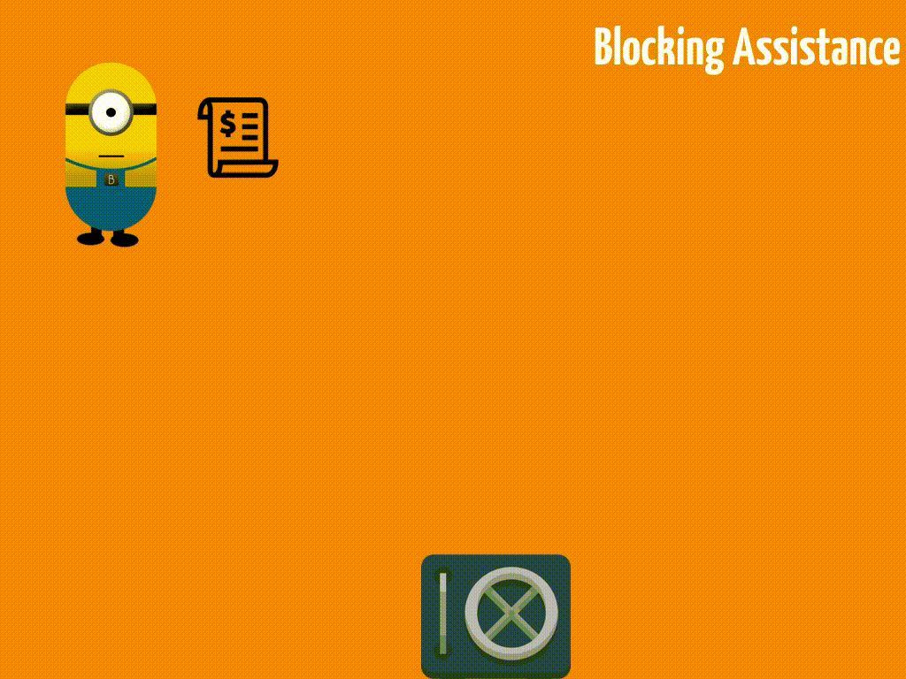
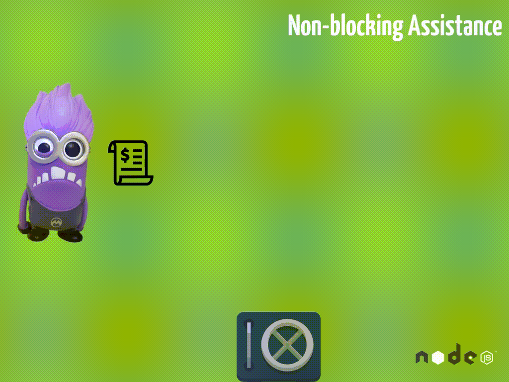

Di artikel ini kita akan berkenalan dengan NodeJS, sebuah platform yang memungkinkan kita menggunakan bahasa pemrograman JavaScript di sisi server. Berikut adalah daftar isinya:

* [Apa itu NodeJS](#apa-itu-nodejs)
* [Kenapa menggunakan NodeJS](#dimana)
  * [JavaScript Ada Dimana-mana](#dimana)
  * [Dukungan Komunitas](#dukungan)
* [Sejarah NodeJS](#sejarah)
* [Memulai NodeJS](#memulai)
* [Lebih Dalam Tentang NodeJS](#lebih-dalam)
* [Aplikasi NodeJS Pertama](#aplikasi-pertama)
    * [Koneksi ke GitHub API](#koneksi)
    * [Membaca Data GitHub API](#membaca)
    * [Parsing Data GitHub API](#parsing)
    * [Mencetak Hasil](#mencetak)
    * [Refactor: Error Handling](#refactor-error)
    * [Refactor #2: Modular Refactor](#refactor-modular)
    * [Refactor 3: Support Multiple Account](#refactor-multiple)
    * [Command Line Argv](#command)
* [Kesimpulan](#kesimpulan)

## <a name='apa-itu-nodejs'></a> Apa itu NodeJS


Berikut definisi Nodejs dari websitenya [ nodejs.org ](https://nodejs.org/):

> "Node.js® is a JavaScript runtime built on **Chrome's V8 JavaScript engine**. Node.js uses an **event-driven**, **non-blocking** I/O model that makes it **lightweight** and **efficient**."

Dari definisi tersebut dapat kita ekstrak lagi menjadi NodeJS adalah:

- Kita bisa menulis kode JavaScript di server (dengan bantuan _V8 engine_-nya Chrome)
- NodeJS sifatnya _event-driven_ dan _non-blocking_
- Yang membuat NodeJS ringan atau _lightweight_ dan efisien.

Beberapa bahasa di server yang kita kenal diantaranya ada PHP, Python, Ruby dan lain sebagainya. Dengan adanya platform NodeJS, sekarang kita dapat menggunakan bahasa pemrograman JavaScript di sisi server, bukan hanya di sisi _client_ saja seperti sebelumnya.

Dan yang lebih menarik lagi adalah NodeJS ini sedikit berbeda pendekatannya dengan bahasa _server-side_ pada umumnya karena sifatnya yang _event-driven_ dan _non-blocking_ seperti yang tertera di definisi tadi. Apa itu _event-driven_ dan _non-blocking_? Mari kita lihat ilustrasi berikut.



Perkenalkan, asisten saya bernama Bob. Tugasnya ada tiga:

1. Mengirim _invoice_ ke _client_
2. Menerima uang dari _client_
3. Memasukkan uang kedalam brankas.

Masalah utama dari si Bob ini adalah semakin banyak _client_ kita, semakin lambat kerjanya si Bob. Kenapa? Karena dia sifatnya menunggu atau dengan kata lain _blocking_. Setelah mengirim _invoice_ ke satu _client_, dia menunggu _client_ untuk membayar baru kemudian ia melakukan pekerjaan berikutnya yang adalah memasukkan uang ke brankas. Baru kemudian dia mengirimkan _invoice_ baru ke _client_ berikutnya.

Jadi agar bisnis lancar, kita harus melakukan _scaling_. Dan _scaling_ yang paling mungkin dilakukan untuk kasus ini adalah menambah asisten baru sehingga masing-masing asisten bisa menangani _client_ yang berbeda.


Masih _blocking_ memang, tapi paling tidak sekarang kita dapat menangani lebih dari satu _client_ tanpa menunggu proses pembayaran dari _client_ sebelumnya selesai. Tapi tetap kurang efektif apalagi jika proses pembayaran waktunya berbeda-beda untuk setiap _client_. Ada yang bayarnya cepat, ada juga yang prosesnya lama dan berbelit-belit.

Lagipula Bob dan Bana si asisten baru di waktu menunggu seperti tidak ada kerjaan dan hanya magabut alias makan gaji buta. Padahal seharusnya sambil menunggu, mereka bisa mengerjakan pekerjaan lainnya sehingga tidak ada waktu atau _resource_ yang terbuang.

Berbeda dengan pendekatan NodeJS, yang memungkinkan si asisten mengerjakan pekerjaan berikutnya tanpa harus menunggu seluruh proses untuk selesai. Seperti ilustrasi berikut.



Yang terjadi adalah kita punya asisten yang 'gila kerja'. Dia mengirimkan semua _invoice_ yang ada ke semua _client_ tanpa peduli kapan _invoice_ tersebut dibayar. Nah ketika nanti ada uang masuk, barulah dia memasukkan uangnya kedalam brankas.

_Non-blocking_-nya terjadi ketika ada _invoice_ baru yang masuk, si asisten ungu ini tetap menerimanya meskipun ia sedang sibuk. Lain halnya dengan si Bob dan Bana di ilustrasi sebelumya. Ketika ada _invoice_ baru yang masuk, sementara _invoice_ lama masih menumpuk, mereka menolak _invoice_ baru untuk masuk.

Proses seperti ini menjadi efektif ketika sebuah _web server_ menerima banyak _request_. Yang membedakan apakah sebuah _platform_ sifatnya _blocking_ atau tidak. Kalau _blocking_ ketika ada _request_ baru dari seorang pengguna, maka _web server_ dipastikan sudah melayani pengguna sebelumnya hingga selesai. Jika prosesnya terlalu lama, si pengguna yang menunggu giliran untuk pelayanan akan meninggalkan _server_ atau dengan kata lain _request timeout_ atau RTO.

Disisi yang lain, _non-blocking_ _server_ akan menerima semua _request_ yang masuk sehingga terjadinya _request timeout_ akan berkurang. Meskipun si pengguna tetap harus menunggu, paling tidak proses antrian sudah tertangani dengan baik.

## <a name='dimana'></a> JavaScript Ada Dimana-mana

Selain itu, **JavaScript is everywhere!** Kita mau coding untuk _web app_, pasti bersentuhan dengan yang namanya JavaScript. Mobile bisa, iOT, Robotic, semua bisa!

Dan karena semua bahasanya sudah sama, meski beberapa API dan library tidak sama kita jadi tidak perlu mengubah _mindset_ kita ketika _coding_ JavaScript di _client_, dan ketika _coding_ bahasa lain di _server_. Sekarang kita bisa melakukan dengan bahasa yang sama!

## <a name='dukungan'></a> Dukungan Komunitas

Dan terakhir, komunitas NodeJS cukup besar. Ada lebih dari 60 juta paket yang tersedia di [ NPM ](https://npmjs.com), sebuah paket manager NodeJS dan banyak pula disponsori oleh perusahaan-perusahaan papan atas, diantaranya: IBM, Wallmart, Netflix, Microsoft, HP, Groupon, Mozilla, Flicker, Uber, PayPal, dan lain sebagainya.

Bahkan IBM di akhir tahun 2015 mengakuisisi StrongLoop, sebuah perusahaan yang membangun _web framework_ untuk NodeJS dan mendukung perkembangan _framework_ seperti [LoopBack](https://loopback.io/) dan [Express](http://expressjs.com/). Wallmart, Netflix dan perusahaan lainnya pun ikut mengembangkan berbagai _framework_ yang dibangun diatas NodeJS.

Dan di Indonesia sendiri, kita juga sudah mulai beberapa yang menggunakan NodeJS di _production_. Sebut saja [UrbanHire](https://www.urbanhire.com/), [KodeFox](https://kodefox.com/), [SaleStock](https://www.salestockindonesia.com/), [DyCode](https://dycode.co.id/), [Cermati](https://www.cermati.com/), dan tentunya [HACKTIV8](https://hacktiv8.com/) yang menjadikan NodeJS sebagai poros dari kurikulumnya.

## <a name='sejarah'></a> Sejarah NodeJS

NodeJS diprakarsai oleh Ryan Dahl yang pertama kali di rilis di tahun **2009** . Ada video _youtube_ -nya yang pada saat dia mendemokan node pertama kalinya di JSConf.eu, _mind blowing_!

<p>
<iframe width="560" height="315" src="https://www.youtube.com/embed/ztspvPYybIY" frameborder="0" allowfullscreen></iframe>
</p>

Empat tahun berselang tepatnya tahun 2013 versi 0.10 muncul dan mulai banyak yang pake juga di _production_ pas versi 0.10 ini.

Lanjut lagi dua tahun kemudian di 2015 versi baru node datang lagi. Kali ini node muncul dengan versi 0.12. Meski belum mencapai versi 1, tapi banyak perusahaan, _freelancer_, startup sudah menggunakan versi ini di _production_ _server_-nya bahkan sejak versi 0.10.

Pada saat it node di backing oleh perusahaan namanya [Joyent](https://www.joyent.com/) dan komunitas node kurang suka dengan bagaimana Joyent me- _manage_ node. Karena menurut beberapa kalangan sebenarnya versi node ini sudah cukup stabil untuk _moving forward_ ke versi 1. Sehingga antara Joyent dan komunitas mulai berbeda visi dan akhirnya komunitas memutuskan untuk mem-_fork_ node dan muncullah [io.js](https://iojs.org/en/) dan langsung merilis versi stabilnya, yaitu versi 1. Tapi akhirnya Joyent mengakui kesalahannya dan membentuk Node Foundation dan akhirnya berhasil menyatukan kembali NodeJS dan ioJS dan langsung memunculkan versi 4.

Masih di tahun yang sama, tepatnya 1 bulan setelah proses rujuk, versi baru muncul lagi, versi 5.  Dan terakhir, tahun ini tepatnya di April muncul versi 6 yang seperti versi 4 merupakan versi Long Time Support atau LTS. Artinya jika kamu atau perusahaan mencari versi yang paling aman dan akan di support lama, gunakanlah versi 6 ini.

## <a name='memulai'></a> Memulai NodeJS

Untuk dapat menggunakan NodeJS, tentunya kita perlu melakukan proses instalasi NodeJS di komputer kita. Caranya gampang, bisa langsung ke official website node-nya di nodejs.org. Ada untuk semua OS baik itu Linux, Mac ataupun Windows.

Atau bisa juga di- _install_ menggunakan _package manager_ seperti [Homebrew](https://brew.sh/) di MacOS, apt-get di Ubuntu Linux, ataupun Chocolatey di Windows. Setelah proses instalasi selesai, sekarang kita bisa ke terminal dan mengetik perintah berikut di terminal atau _command line_.

```sh
$ node -v
v6.9.1
```

Dan akan muncul versi node yang terinstal. Saya masih menggunakan versi 6.9.1. Mungkin hasilnya akan berbeda tergantung versi stabil terakhir, bisa jadi versi 7 atau yang lebih baru.

Apabila sudah terinstall, mari kita bermain-main dengan _tools_ yang bernama REPL atau _Read Eval Print Loop_ untuk belajar _syntax_ dan beberapa _library_ NodeJS. Kali ini cukup mengetikkan perintah `node` dari terminal atau _command line_.


## <a name='lebih-dalam'></a> Lebih Dalam Tentang NodeJS

Mari kita gali lebih dalam tentang NodeJS. Kita akan melihat dan menggunakan _build-in function_ yang disediakan oleh NodeJS. Untuk melihat apa saja _build-in function_ yang tersedia bisa ke dokumentasi [NodeJS disini](https://nodejs.org/dist/latest-v6.x/docs/api/).

Beberapa fungsi menarik diantaranya ada [file system](https://nodejs.org/dist/latest-v6.x/docs/api/fs.html), [stream](https://nodejs.org/dist/latest-v6.x/docs/api/stream.html), [path](https://nodejs.org/dist/latest-v6.x/docs/api/path.html) dan tentunya [http](https://nodejs.org/dist/latest-v6.x/docs/api/http.html) yang menjadi _first-class citizen_ di NodeJS.

Mari kita lihat beberapa _code sample_ dari modul `http` di dokumentasi. 

```javascript
http.get('http://nodejs.org/dist/index.json', (res) => {
  const statusCode = res.statusCode;
  const contentType = res.headers['content-type'];

  let error;
  if (statusCode !== 200) {
    error = new Error(`Request Failed.\n` +
                      `Status Code: ${statusCode}`);
  } else if (!/^application\/json/.test(contentType)) {
    error = new Error(`Invalid content-type.\n` +
                      `Expected application/json but received ${contentType}`);
  }
  if (error) {
    console.log(error.message);
    // consume response data to free up memory
    res.resume();
    return;
  }

  res.setEncoding('utf8');
  let rawData = '';
  res.on('data', (chunk) => rawData += chunk);
  res.on('end', () => {
    try {
      let parsedData = JSON.parse(rawData);
      console.log(parsedData);
    } catch (e) {
      console.log(e.message);
    }
  });
}).on('error', (e) => {
  console.log(`Got error: ${e.message}`);
});
```

Contoh _code_ diatas adalah bagaimana kita mengambil data dari sebuah website `http://nodejs.org/dist` dalam format JSON. Berikutnya dicek apakah url yang diberikan valid atau tidak. Dan ketika url valid dan data yang kita inginkan ada, maka tampilkan dengan perintah `console.log`.

## <a name='aplikasi-pertama'></a> Aplikasi NodeJS Pertama

Mari kita membuat aplikasi NodeJS pertama dengan satu atau beberapa _build-in function_ yang disediakan oleh NodeJS.

Yuk kita buat aplikasi paling terkenal di dunia: "Hello world" di NodeJS. Caranya gampang, buka editor, buat sebuah file dengan extensi js, save dan lalu jalankan dengan mengetik `node app.js` misalnya. Yuk kita praktekkan.

```sh
mkdir first-app
cd first-app
vim app.js
```

Simple aja isinya:

```javascript
console.log("Hello, Bandung!")
```

Balik ke terminal, kita eksekusi `app.js` kita

```javascript
$ node app.js
"Hello, Bandung!"
```

Voala! Yay! Berhasil!! Seperti yang kita harapkan, di terminal akan menghasilkan sebuah string "Hello, Bandung!".

Sekarang kita bikin aplikasi beneran nih ya, yang bermanfaat tentunya. Langsung aja kita definisikan di `app.js` untuk memulai mendefinisikan apa yang mau kita buat untuk aplikasi pertama kita di NodeJS.

```sh
$ vim app.js
```

Jadi gini, ceritanya saya punya masalah nih. Saya ceritanya pengen supaya ngecek profil [GitHub](https://github.com/rizafahmi) seseorang dengan lebih mudah. Supaya simpel, kita akan membuat aplikasi _command line_. Jadi kita bisa melihat profil github seseorang dari _command line_. Pertama, kita definisikan saja _problem_ dan _solution_-nya langsung sekaligus langkah-langkah yang perlu kita lakukan atau seperti _pseudocode_ -nya gitu. Biar jelas lebih jelas dan terarah.

```javascript
// app.js

// Problem: We need a simple way to look at GitHub profile
// Solution: Use NodeJS to connect to GitHub API to get profile information and print out to the console

// TODO: Connect to the GitHub API
// TODO: Read the data
// TODO: Parse the data
// TODO: Print the data out

```

Langkah-langkahnya cukup sederhana. Pertama, kita perlu cari tahu gimana cara koneksi dengan GitHub API dan gimana cara mengambil data dari GitHub API, lalu kemudian ketika sudah tahu bagaimana cara mengambil data dari GitHub API, langkah selanjutnya adalah bagaimana cara membaca data tersebut. Setelah bisa dibaca, bagaimana caranya supaya data tersebut di konversi ke bentuk yang dapat dimengerti oleh JavaScript atau istilah kerennya parsing data. Dan terakhir, kita cetak hasilnya.

Ok, langsung kita mulai saja yuk!

### <a name='koneksi'></a> Koneksi ke GitHub API

Mari kita mulai langkah pertama. Untuk GitHub API kita bisa googling "api github" dan kita bisa dapat dokumentasi [github API](https://developer.github.com/v3/users/) -nya. Dan yang kita cari juga cukup jelas, kita ingin mendapatkan detil informasi dari sebuah akun GitHub. Jadi kita bisa gunakan API "Get a single user". Jadi misalnya saya bisa dapat detil akun saya dengan cara seperti ini: [api.github.com/users/rizafahmi](http://api.github.com/users/rizafahmi). Dari situ kita bisa dapat nama, email, _followers_ dan lain-lain.

Nah sekarang pertanyaannya gimana caranya kita bisa dapat data dari url tersebut via NodeJS? Kita bisa gunakan salah satu build-in library nodejs yang tadi sudah kita lihat, `http` . Mari kita lihat lagi [dokumentasinya](https://nodejs.org/dist/latest-v6.x/docs/api/http.html) . Kita bisa gunakan `http.get` dan sudah ada _sample code_ -nya juga. Mari kita langsung coba.

```javascript
// Problem: We need a simple way to look at GitHub profile
// Solution: Use NodeJS to connect to GitHub API to get profile information and print out to the console

// TODO: Connect to the GitHub API
const http = require('http')
http.get('https://api.github.com/users/rizafahmi', (response) => {
  console.log(`Got response: ${response.statusCode}`);
  // consume response body
  response.resume();
}).on('error', (error) => {
  console.log(`Got error: ${error.message}`);
});

// TODO: Read the data
// TODO: Parse the data
// TODO: Print the data out
```

Ketika kita jalankan `node app.js` maka akan muncul _error_ seperti berikut: `Error: Protocol "https:" not supported. Expected "http:"`.
Nah cukup jelas ya masalahnya. Kita menggunakan _library_ http sedangkan URL yang kita berikan https (https://api.github.com/users/rizafahmi). Dan apabila kita akses API GitHub tersebut menggunakan http, akan otomatis _redirect_ ke versi https. Jelas disini GitHub hanya mendukung versi https.

Karena itu kita bisa menggunakan _library_ yang serupa yaitu [https](https://nodejs.org/dist/latest-v6.x/docs/api/https.html). Mari kita ganti code kita.

```javascript
const https = require('https')

https.get('https://api.github.com/users/rizafahmi', (res) => {
  console.log('statusCode:', res.statusCode)
  console.log('headers:', res.headers)

  res.on('data', (d) => {
    process.stdout.write(d)
  })
}).on('error', (e) => {
  console.error(e)
})
```

Dan sekarang, kalau kita eksekusi lagi maka kita akan dapat response code 403 yang artinya forbidden. Ini artinya GitHub me-reject permintaan atau request kita. Kenapa ya? Coba kita googling "nodejs github api 403". Dan ternyata setiap API harus menyertakan `user-agent` . Nah gimana caranya kita menyertakan options `user-agent` ? Kita berarti ngga bisa pake `https.get` tapi lebih cocok `https.request`

```javascript
'use strict'
  const https = require('https')

  const username = 'rizafahmi'
  // Connect to the GitHub API (https://api.github.com/users/username)
  const options = {
   hostname: `api.github.com`,
   port: 443,
   path: `/users/${username}`,
   method: 'GET',
   headers: {
   'user-agent': 'node.js'
   }
  }
  let request = https.request(options, (response) => {
   console.log(response.statusCode)
   // TODO: Read the data
   // TODO: Parse the data
   // TODO: Print the data out

  })

  request.end()

  request.on('error', (e) => {
   console.error(e)
  })
```

Nah sekarang, kalau kita execute lagi, hasilnya jadi 200, artinya sudah ok tinggal kita baca datanya yang adalah langkah kita berikutnya, sesuai TODO yang tadi kita buat. _Well done!_


### <a name='membaca'></a> Membaca Data GitHub API

Ok, sekarang kita lanjut ke todo kedua kita yang adalah proses membaca data. Kalau kita lihat kembali di dokumentasi HTTPS, di code sample sudah disertakan gimana cara membaca data, dengan method `response.on('data')` . Langsung aja kita coba baca data yang didapat dari GitHubAPI. Dan karena data yang kita terima bentuknya stream atau satu per satu, kita harus ngumpulin dulu data yang kita dapat ke satu variable dan begitu ketemu data terakhir, baru kita console.log. Gimana caranya kita tau data sudah diterima semua? Kita bisa menggunakan method `response.on('end')` . Langsung kita praktekkan aja ya.

```javascript
let request = https.request(options, (response) => {
   console.log(response.statusCode)
   // [x] Read the data
   let body = ""
   response.on('data', (data) => {
     body = body + data
   })

   response.on('end', () => {
     console.log(body)
   })
   // TODO: Parse the data
   // TODO: Print the data out
})

```

Sekarang kita coba hasil dari body seperti apa? Dan kita akan mendapatkan datanya mirip dengan yang kita dapatkan sewaktu kita akses di browser.

```text
200
{"login":"rizafahmi","id":1147918,"avatar_url":"https://avatars0.githubusercontent.com/u/1147918?v=3","gravatar_id":"","url":"https://api.github.com/users/rizafahmi","html_url":"https://github.com/rizafahmi","followers_url":"https://api.github.com/users/rizafahmi/followers","following_url":"https://api.github.com/users/rizafahmi/following{/other_user}","gists_url":"https://api.github.com/users/rizafahmi/gists{/gist_id}","starred_url":"https://api.github.com/users/rizafahmi/starred{/owner}{/repo}","subscriptions_url":"https://api.github.com/users/rizafahmi/subscriptions","organizations_url":"https://api.github.com/users/rizafahmi/orgs","repos_url":"https://api.github.com/users/rizafahmi/repos","events_url":"https://api.github.com/users/rizafahmi/events{/privacy}","received_events_url":"https://api.github.com/users/rizafahmi/received_events","type":"User","site_admin":false,"name":"Riza Fahmi","company":"Hacktiv8","blog":"https://hacktiv8.com","location":"Jakarta","email":null,"hireable":true,"bio":"Curriculum Director at @hacktiv8 ","public_repos":213,"public_gists":7,"followers":96,"following":16,"created_at":"2011-10-24T10:34:43Z","updated_at":"2017-05-12T05:44:53Z"}
```

Itu artinya kita sudah bisa melakukan langkah berikutnya, yaitu parsing datanya.

### <a name='parsing'></a> Parsing Data GitHub API

Sekarang kita masuk ke todo kita yang ketiga, yang adalah parsing data. Gimana cara kita parsing data? Kita kan berharap datanya dalam bentuk JSON object. Tapi data body yang kita terima tadi kan bentuknya string. Nah di JavaScript ada method atau class yang dapat melakukan operasi mengubah dan membaca JSON, baik itu dari string ataupun sebaliknya dari JSON object menjadi string. Nah, kita bisa manfaatkan modul ini. Kalo kita buka [Mozilla Developer Network](https://developer.mozilla.org/en-US/docs/Web/JavaScript/Reference/Global_Objects/JSON) disitu ada method namanya `JSON.parse()` . Nah pas nih, kita bisa gunakan ini. Caranya cukup gampang dan bisa langsung kita implementasikan.

```javascript
  let request = https.request(options, (response) => {
   console.log(response.statusCode)
   // [x] Read the data
   let body = ""
   response.on('data', (data) => {
   body = body + data
   })

   response.on('end', () => {
   // [x] Parse the data
   let profile = JSON.parse(body)
   console.log(profile)
   console.log(typeof profile)
   // TODO: Print the data out
   })

  })
```

Kita coba eksekusi lagi, nah sekarang _instead of string_, kita dapat tipe datanya sudah berubah menjadi object. Itu artinya parsing data kita berhasil.

### <a name='mencetak'></a> Mencetak Hasil

Nah sekarang task terakhir kita, yang adalah mencetak hasilnya. Sebelum mencetak hasilnya, kita tentukan dulu apa yang mau kita cetak. Kita akan menampilkan nama, jumlah public reponya dan follower-nya. Ok, kita buat aja fungsi untuk mencetak hasilnya.

```javascript
  let printData = (name, publicRepos, followers) => {
   console.log(`${name} owns ${publicRepos} repo(s) and has ${followers} follower(s)`)
  }

  response.on('end', () => {
   // [x] Parse the data
   let profile = JSON.parse(body)
   // [x] Print the data out
   // prints out name, publicRepos, followers
   printData(profile.name, profile.public_repos, profile.followers)
   })
```

Kita bikin fungsi yang khusus untuk mencetak data tujuannya agar dapat dipakai berulang-ulang. Ingat prinsip DRY, don't repeat yourself.

Sekarang, kalau kita jalankan app.js nya, kita akan mendapatkan informasi yang cukup bagus dan _user friendly_ :)

```text
$ node app.js
Riza Fahmi owns 214 repo(s) and has 98 follower(s)
```

Sip! Tugas terakhir kita selesai.

### <a name='refactor-error'></a> Refactor: Error Handling

Aplikasi kita sudah selesai, tapi aplikasi kita saat ini baru memikirkan versi optimis dari alur kerja aplikasi. Gimana seandainya kalau _username_ tidak ditemukan? Kita coba ya. Kita ganti username supaya usernamenya tidak ditemukan.

```javascript
  const username = 'usernameasalsajabiartidakketemu'
```

Dan kalau kita jalankan, maka akan muncul pesan:

  undefined owns undefined repo(s) and has undefined follower(s)

Yup, ini _expected_ ya. Karena aplikasi tidak dapat menemukan data si 'usernameasalsajabiartidakketemu' ini, jadinya undefined. Nah, di artikel ini kita akan meng-handle kesalahan seperti ini. Caranya gimana? Kita bisa memanfaatkan `statusCode`. Jadi kalau statusCode-nya 200 artinya sukses. Selain 200 artinya gagal.

```javascript
response.on('end', () => {
 if (response.statusCode === 200) {
 let profile = JSON.parse(body)
   printData(profile.name, profile.public_repos, profile.followers)
 } else {
   printError({message: `Profile with username '${username}' not found. (${response.statusCode})` })
 }
})
```

Sekarang kita coba lagi, hasilnya sudah cukup user friendly.

```text
  Profile with username 'rizafahmi22' not found. (404)
```

Pesan _error_ menjadi lebih _user friendly_ kan :)

### <a name='refactor-modular'></a> Refactor #2: Modular Refactor

Sekarang kita akan me-refactor lebih jauh. Kita akan membuat code kita lebih modular. Lebih modular gimana? Ide nya adalah supaya modul _get profile_ yang kita buat ini dapat digunakan berkali-kali tanpa ada duplikasi code. Kita ingin nantinya kita dapat memanggil _get profile_ seperti berikut.

```javascript

  profile.get('rizafahmi')

```

Caranya gampang, pertama kita buat file baru dulu, kita namakan saja `profile.js` yang nantinya akan kita gunakan di `app.js` kita.

```javascript
// profile.js
const https = require('https')
let get = (username) => {
  const options = {
    hostname: 'api.github.com',
              port: 443,
              path: `/users/${username}`,
              method: 'GET',
              headers: {
                'user-agent': 'nodejs'
              }
  }
  let request = https.request(options, (response) => {
      let body = ''
      response.on('data', (data) => {
          body = body + data
      })
      response.on('end', () => {
          let profile = JSON.parse(body)

          if (profile.message !== 'Not Found') {
            printData(profile)
          } else {
            console.log('User not found')
          }
      })
  })

  let printData = (profile) => {
    console.log(`${profile.name} owns ${profile.public_repos} repo(s) and has ${profile.followers} follower(s)`)
  }

  request.end()

  request.on('error', (e) => {
    console.log(e)
  })
}

module.exports.get = get

```

Code-nya masih sama, yang membedakan hanya bagian `module.exports.get = get` aja. Hal ini dilakukan supaya kita bisa menggunakan modul profile ini di file yang berbeda, dalam hal ini `app.js` .

Sekarang tinggal kita import atau require dari `app.js` kita saja.

```javascript
// app.js
'use strict'

const profile = require('./profile.js')

profile.get('rizafahmi')
profile.get('adhywiranata')
profile.get('tamatamvan')

```

Jadi lebih rapi kan `app.js` kita?! Dan kalau kita eksekusi, akan muncul tiga profile github beserta informasi detail-nya. Ok, ini ada hal yang menarik. Kalau diperhatikan, sequence-nya tidak berurutan. Kita memanggil profile riza, adhy dan tama, tapi yang tercetak malah beda urutannya. Coba kita eksekusi sekali lagi, urutannya bisa beda lagi, bisa juga sama.

```text
$ node app.js

Adhy Wiranata Prasetyo owns 50 repo(s) and has 16 follower(s)
Riza Fahmi owns 214 repo(s) and has 98 follower(s)
Septian A Tama (tamatamvan) owns 50 repo(s) and has 17 follower(s)

$  node app.js
Septian A Tama (tamatamvan) owns 50 repo(s) and has 17 follower(s)
Adhy Wiranata Prasetyo owns 50 repo(s) and has 16 follower(s)
Riza Fahmi owns 214 repo(s) and has 98 follower(s)

```

Kenapa begitu? Kalau kalian ingat di pembahasan diatas kita sempat bahas tentang _nature_ -nya nodejs yang adalah non-blocking, yang kita analogikan dengan asisten minion. Jadi nodejs ini mengeksekusi ketiga profile.get tanpa menunggu hasil balikannya. Sama seperti evil minion yang mengirimkan invoice terus menerus tanpa menunggu pembayaran dari client.

Jadi ada hasil yang datang duluan, misalnya dengan jumlah repo yang lebih sedikit dia akan return duluan dibanding dengan yang reponya banyak. Ada pengaruh koneksi juga disini. Makanya urutannya tidak selalu sama.

Hal ini berbeda dengan bahasa pemrograman sequential. Jika di sequential, urutannya sudah pasti sama. Karena begitu line 5 di eksekusi dia akan menunggu sampai hasilnya balik dan nge-print kemudian baru dia akan mengeksekusi line berikutnya dan seterusnya.

### <a name='refactor-multiple'></a> Refactor 3: Support Multiple Account

Refactor terakhir nih! Setelah sebelumnya kita sudah bisa mendapatkan satu atau lebih informasi akun github, sekarang kita akan refactor sehingga kita cukup menyediakan array of username, kemudian aplikasi node kita akan mencari info tersebut dan print ke console. Jika sebelumnya ada perulangan code di `app.js` kita. Kita memanggil `profile.get` tiga kali. Dan repetisi didalam code tidak baik.

Refactor ini cukup sederhana dan simpel. Kita bisa gunakan perulangan seperti for, dan foreach. Tapi karena kita menggunakan Node versi 6 keatas yang sudah support 99% syntax ES6 yang baru, kita bisa menggunakan syntax `map`. Buat yang belum familiar dengan `map`, bisa baca artikel menarik [berikut ini](https://www.discovermeteor.com/blog/understanding-javascript-map/).

Ok, kalau sudah cukup paham tentang `map`, mari kita mulai implementasi map di code kita.

```javascript
// app.js
'use strict'

const profile = require('./profile.js')

const users = ['rizafahmi', 'adhywiranata', 'tamatamvan']
users.map((user) => {
  return profile.get(user)
})
// or equal to this beautiful one line: `users.map(profile.get)`
```


Sederhana kan?! Sekarang coba kita eksekusi. Hasilnya tetap sama seperti sebelumnya, tapi code kita lebih bersih dan tidak ada duplikasi. Oh iya, map ini bisa kita buat lebih sederhana, seperti ini:

```javascript
// app.js
'use strict'

const profile = require('./profile.js')

const users = ['rizafahmi', 'adhywiranata', 'tamatamvan']
users.map(profile.get)

```

Wih, elegan sekali! Coba eksekusi lagi. Hasilnya tetap sama, tentu saja.

### <a name='command'></a> Command Line Argv

Terakhir, saatnya 'menyulap' aplikasi kita menjadi _usable CLI_, atau command line application. Kalau saat ini jika kita ingin mencari tahu profile github seseorang, kita harus edit file `app.js` kita kemudian kita eksekusi dengan cara node app.js. Nah, sekarang biar lebih sempurna, gimana caranya supaya kita bisa dapatkan profil seseorang langsung dari command line tanpa harus bolak-balik mengedit file source kita?!

Sebenarnya cukup mudah secara aplikasi kita sudah modular. Satu _missing piece_-nya adalah gimana cara kita membaca argumen atau parameter dari command line. Nah, di NodeJS ada global variable yang namanya `process` yang bisa kita gunakan untuk ini. Ada di dokumentasi nodejs juga, [disini](https://nodejs.org/dist/latest-v6.x/docs/api/process.html)

Dan ada banyak sebenarnya isi dari process ini. Yang kita butuhkan adalah [argv](https://nodejs.org/dist/latest-v6.x/docs/api/process.html#process_process_argv).

Kalau kita lihat sample code nya cukup jelas ya, cara penggunaannya dan cara mendapatkan parameternya. Mari kita implementasikan ke code kita. Pertama-tama kita coba console dulu aja argv nya.

```javascript
// app.js
'use strict'

const profile = require('./profile.js')

console.dir(process.argv, {colors: true})
```

Dan kemudian kita eksekusi dengan menambahkan parameter setelah `app.js`.

```text
$ node app.js adhywiranata rizafahmi
[ '/Users/riza/.nvm/versions/node/v8.0.0/bin/node',
 '/Users/riza/Developers/NodeJS/blog/firstapp/app.js',
 'adhywiranata',
 'rizafahmi' ]
```
Dan kita akan mendapatkan return dalam bentuk array. Array 0 adalah path ke node kita. Array 1 adalah path ke app kita, dalam hal ini app.js. Nah mulai dari array 2 hingga akhir array itu isinya parameter yang kita input. Jadi kita ambil array kedua hingga terakhir dan kita print setiap username menjadi profile dengan memanggil `profile.get` . Gimana caranya untuk mendapatkan array kedua hingga akhir array? Kita bisa gunakan method `slice` atau potong, harfiahnya. Berikut [dokumentasinya](https://developer.mozilla.org/en/docs/Web/JavaScript/Reference/Global_Objects/Array/slice).

Sehingga aplikasi kita simply seperti berikut:
```javascript
// app.js
'use strict'

const profile = require('./profile.js')

const users = process.argv.slice(2)
users.map(profile.get)
```

Coba sekarang kita jalankan `node app.js adhywiranata rizafahmi tamatamvan`. Dan selesailah aplikasi kita yang cukup berguna dan simpel ini.

```text
$ node app.js adhywiranata rizafahmi tamatamvan
Septian A Tama (tamatamvan) owns 50 repo(s) and has 17 follower(s)
Adhy Wiranata Prasetyo owns 50 repo(s) and has 16 follower(s)
Riza Fahmi owns 214 repo(s) and has 98 follower(s)

```


## <a name='kesimpulan'></a> Kesimpulan

Banyak sekali hal-hal baru yang sudah kita pelajari bersama. Sebagai penutup mari kita merekap apa saja yang sudah kita pelajari dari artikel ini:

* Apa itu NodeJS
* Sejarah NodeJS
* Bagaimana non-blocking bekerja
* Kenapa menggunakan NodeJS
* Memulai NodeJS
* Menggunakan build-in function NodeJS seperti Http dan Https
* Parsing data dari tipe data string menjadi JavaScript Object
* Mencetak data ke terminal
* Error handling sederhana
* Refactor
* Menggunakan process.argv untuk membuat aplikasi CLI

Cukup banyak juga ya ternyata. _Congratulations!_ Dan sampai jumpa!
